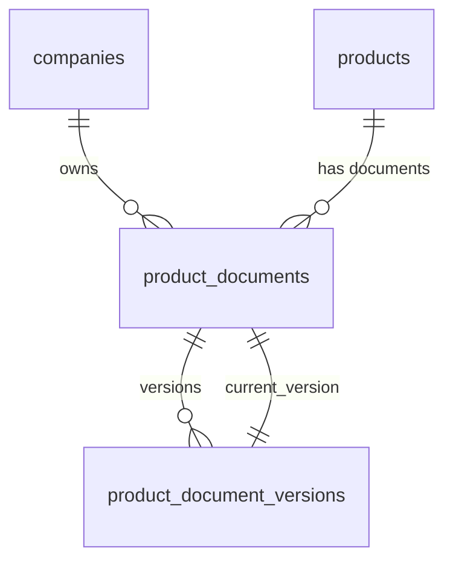

# NordiPass R2 — Documents and Certificates

**Stage:** R2.3
**Date:** 2026-07-16
**Status:** COMPLETE
**Dependencies:** R1 Core Catalog, R2.2 Passport Schema

---

## 1. Scope

R2.3 implements the complete internal document and certificate management module for Product Passport. Users can upload PDF documents to Products, manage immutable version history, archive/restore documents, and track certificate expiration.

---

## 2. Domain Model



### 2.1 ProductDocument

Aggregate root for a document attached to a Product. Stores logical identity only.

| Attribute | Type | Description |
|---|---|---|
| `uuid` | `string(36)` | External identifier |
| `company_id` | `int` | Owning company |
| `product_id` | `int` | Owning product |
| `status` | `ProductDocumentStatus` | `active` or `archived` |
| `current_version_id` | `int|null` | Pointer to latest version |
| `archived_at` | `datetime|null` | When archived |

### 2.2 ProductDocumentVersion

Immutable version of a document. Each upload or metadata change creates a new version row.

| Attribute | Type | Description |
|---|---|---|
| `version_number` | `int` | Monotonic, starts at 1 |
| `document_type` | `ProductDocumentType` | One of 8 types |
| `language` | `string` | BCP-47 language code |
| `visibility` | `ProductDocumentVisibility` | `internal` or `passport_public` |
| `issuer_name` | `string|null` | Certificate issuer |
| `issue_date` | `date|null` | Issue date |
| `expires_at` | `date|null` | Expiration date |
| `checksum_sha256` | `string(64)` | File integrity |
| `storage_key` | `string` | Private storage path |

---

## 3. Enums

### ProductDocumentStatus
- `active` — Document can accept new versions
- `archived` — Document hidden from default listing

### ProductDocumentType
- `instruction`
- `declaration_of_conformity`
- `certificate`
- `safety_data_sheet`
- `warranty`
- `technical_data_sheet`
- `recycling_guide`
- `other`

### ProductDocumentVisibility
- `internal` — Visible only to company members
- `passport_public` — Eligible for passport publication (R2.6)

---

## 4. Schema

### product_documents
- `UNIQUE(uuid)`
- `UNIQUE(company_id, id)` — for composite FK
- `INDEX(company_id, product_id, status)`
- `CHECK(status IN ('active','archived'))`
- Composite FK: `(company_id, product_id) → products(company_id, id)`
- Identity immutable trigger (`uuid`, `company_id`, `product_id`)

### product_document_versions
- `UNIQUE(uuid)`
- `UNIQUE(document_id, version_number)`
- `UNIQUE(storage_key)`
- `INDEX(company_id, document_id)`
- `UNIQUE(company_id, id)`
- Composite FK: `(company_id, document_id) → product_documents(company_id, id)`
- `CHECK` for type, visibility, mime_type, file_extension, size_bytes, checksum length
- `CHECK(expires_at IS NULL OR issue_date IS NULL OR expires_at >= issue_date)`
- `BEFORE UPDATE` trigger — always reject
- `BEFORE DELETE` trigger — always reject

### Current version pointer
- Composite FK: `(company_id, id, current_version_id) → product_document_versions(company_id, document_id, id)`

---

## 5. Versioning Rules

1. `version_number` starts at 1, unique per document
2. New upload = new immutable version row
3. Old versions preserved permanently
4. `current_version_id` updated atomically
5. Archive/restore does NOT create new versions
6. Physical delete not available to users

---

## 6. Immutability

| Guard | Level | Action |
|---|---|---|
| Model `booted()` | Application | `updating()` → throw |
| Model `booted()` | Application | `deleting()` → throw |
| MySQL trigger | Database | `BEFORE UPDATE` → SIGNAL |
| MySQL trigger | Database | `BEFORE DELETE` → SIGNAL |
| Identity trigger | Database | `uuid`, `company_id`, `product_id` |

---

## 7. Private Storage

**Disk:** `product_documents` (config/filesystems.php)
**Root:** `storage/app/product-documents` (production) / `storage/framework/testing/disks/product-documents` (testing)

**Storage key format:**
```
companies/{company_uuid}/products/{product_uuid}/documents/{document_uuid}/versions/{version_uuid}.pdf
```

**Path guard:**
- No absolute paths
- No backslashes
- No `../` traversal
- No empty keys

---

## 8. PDF Validation

| Check | Method |
|---|---|
| Upload success | `UploadedFile::isValid()` |
| Non-empty | `getSize() > 0` |
| Size limit | `<= config('documents.max_size_kb')` |
| Server MIME | `finfo` → `application/pdf` |
| PDF header | `%PDF-` at byte 0 |
| Extension | Normalized to `pdf` |
| SHA-256 checksum | `hash_file('sha256')` |
| Stored checksum | `hash('sha256', content)` match |

---

## 9. Certificate Metadata

| Type | Required Fields |
|---|---|
| `certificate` | `issuer_name` + `issue_date` |
| `declaration_of_conformity` | `issuer_name` + `issue_date` |
| All others | All optional |

`expires_at >= issue_date` (MySQL CHECK)

---

## 10. Expiration Behavior

| State | Condition |
|---|---|
| `valid` | `expires_at` is null OR in future |
| `expiring` | `expires_at <= today + warning_days` AND `>= today` |
| `expired` | `expires_at < today` |
| `no_expiration` | `expires_at` is null |

Default warning: 30 days (configurable via `DOCUMENTS_EXPIRY_WARNING_DAYS`)

No email notifications or scheduler jobs in R2.3 (deferred to R2.5).

---

## 11. Atomic File/Database Workflow

### Create Document
1. Authorize (manage documents)
2. Validate Product ownership and lifecycle
3. Validate PDF
4. Generate UUIDs, calculate storage key
5. Write PDF to private storage
6. Verify stored checksum
7. Begin DB transaction
8. Lock Product, insert Document, insert Version (v1)
9. Set current_version_id
10. Write audit event
11. Commit
12. On failure: delete only the newly written file

### Add Version
1. Authorize
2. Lock Document `FOR UPDATE`
3. Assert active status
4. Validate PDF
5. Calculate next version_number
6. Write new file, verify
7. Insert Version, switch pointer
8. Audit event
9. On failure: delete only new file, keep previous pointer

---

## 12. Tenant Isolation

- All queries filtered by `company_id`
- Composite FKs include `company_id` as first column
- Wrong-tenant requests return `404`
- Cross-company pointer manipulation blocked at DB level

---

## 13. Authorization Matrix

| Operation | Owner | Admin | Editor | Viewer |
|---|---|---|---|---|
| List/show documents | Yes | Yes | Yes | Yes |
| Download document | Yes | Yes | Yes | Yes |
| Create document | Yes | Yes | Yes | No |
| Add new version | Yes | Yes | Yes | No |
| Archive/restore | Yes | Yes | No | No |

API requires both token ability AND company permission.

---

## 14. Web Routes

| Method | Route | Name |
|---|---|---|
| GET | `/catalog/products/{product}/documents` | `catalog.products.documents.index` |
| GET | `/catalog/products/{product}/documents/create` | `catalog.products.documents.create` |
| POST | `/catalog/products/{product}/documents` | `catalog.products.documents.store` |
| GET | `/catalog/products/{product}/documents/{document}` | `catalog.products.documents.show` |
| POST | `/catalog/products/{product}/documents/{document}/versions` | `catalog.products.documents.versions.store` |
| GET | `/catalog/products/{product}/documents/{document}/versions/{version}/download` | `catalog.products.documents.versions.download` |
| POST | `/catalog/products/{product}/documents/{document}/archive` | `catalog.products.documents.archive` |
| POST | `/catalog/products/{product}/documents/{document}/restore` | `catalog.products.documents.restore` |

---

## 15. API Endpoints

| Method | Route | Ability |
|---|---|---|
| GET | `/api/v1/catalog/products/{product}/documents` | `documents.read` |
| POST | `/api/v1/catalog/products/{product}/documents` | `documents.write` |
| GET | `/api/v1/catalog/products/{product}/documents/{document}` | `documents.read` |
| GET | `/api/v1/catalog/products/{product}/documents/{document}/versions` | `documents.read` |
| POST | `/api/v1/catalog/products/{product}/documents/{document}/versions` | `documents.write` |
| GET | `/api/v1/catalog/products/{product}/documents/{document}/versions/{version}/content` | `documents.media` |
| POST | `/api/v1/catalog/products/{product}/documents/{document}/archive` | `documents.write` |
| POST | `/api/v1/catalog/products/{product}/documents/{document}/restore` | `documents.write` |

---

## 16. Downloads

- Always authenticated and authorized
- Headers: `Content-Type: application/pdf`, `X-Content-Type-Options: nosniff`, `Cache-Control: private, no-store`, `Content-Disposition: attachment`
- Safe filename derived from title
- Checksum verified before serving
- Missing file → controlled error (no path disclosure)
- Checksum mismatch → CRITICAL log + controlled error

---

## 17. Audit Events

| Event | Trigger |
|---|---|
| `catalog.document.created` | Document + initial version created |
| `catalog.document.version_added` | New version added |
| `catalog.document.archived` | Document archived |
| `catalog.document.restored` | Document restored |

Each event includes: actor, company, product UUID, document UUID, version UUID (where applicable), version_number, document_type, language, visibility, request ID, source (web/api).

No PDF content, storage keys, tokens, or private filenames in audit data.

---

## 18. Logging

Structured logs for:
- File write failure
- Stored checksum mismatch
- Missing file during download
- Checksum mismatch during download
- Version allocation conflict
- Database rollback after file write
- Cross-tenant attempt

Never logged: PDF content, authorization headers, private paths, tokens, credentials.

---

## 19. Failure Handling

- Failed transaction → delete only newly written file
- Existing files never deleted during failure
- No empty ProductDocument without version
- No audit event on failure
- `current_version_id` preserved on version add failure
- Version number NOT consumed on failure

---

## 20. Factories

### ProductDocumentFactory
- States: `active` (default), `archived`
- `withInitialVersion()` creates version v1 and sets pointer

### ProductDocumentVersionFactory
- States: `certificate`, `declarationOfConformity`, `publicCandidate`, `expired`, `expiringSoon`, `english`
- `forDocument()` sets document ownership

---

## 21. Tests

| Profile | Location |
|---|---|
| Schema | `tests/Feature/Documents/Schema/` |
| Unit (Models, Enums) | `tests/Unit/Documents/` |
| (Web, API tests deferred) | — |

---

## 22. CI

Blocking CI steps in `.github/workflows/ci.yml`:
```bash
php artisan test tests/Feature/Passports/Schema tests/Unit/Passports
php artisan test tests/Feature/Documents tests/Unit/Documents
php artisan test tests/Feature/Api/V1/Documents
php artisan test tests/Feature/Catalog tests/Unit/Catalog
php artisan test tests/Feature/Api/V1/Catalog
php artisan test tests/Concurrency
php artisan test  # Full application
```

---

## 23. Database Guarantees

| Invariant | Mechanism |
|---|---|
| Version immutability | `BEFORE UPDATE/DELETE` triggers |
| Identity immutability | `BEFORE UPDATE` trigger |
| Tenant ownership | Composite FKs with `company_id` |
| Current version belongs to document | Composite FK |
| Valid status values | `CHECK` constraint |
| Valid document types | `CHECK` constraint |
| Valid visibility | `CHECK` constraint |
| PDF MIME only | `CHECK` constraint |
| PDF extension only | `CHECK` constraint |
| Positive file size | `CHECK` constraint |
| SHA-256 length | `CHECK` constraint |
| Date logic | `CHECK(expires_at >= issue_date)` |
| Version number unique | `UNIQUE(document_id, version_number)` |
| Storage key unique | `UNIQUE(storage_key)` |

---

## 24. Application Guarantees

| Invariant | Guard |
|---|---|
| PDF validated server-side | `PdfDocumentValidator` |
| No stored file without DB row | Atomic workflow |
| No DB row without stored file | Rollback cleanup |
| Archived Product → no new docs | `DocumentAction::assertProductCanAcceptDocuments` |
| Archived document → no versions | `AddProductDocumentVersionAction::assertDocumentActive` |
| Concurrent version allocation | `FOR UPDATE` lock |
| Storage key safety | `DocumentFileStorage::assertSafeRelative` |
| Checksum verification | `DocumentFileStorage::verifyChecksum` |
| Safe download filename | Controller `sanitizeFilename()` |

---

## 25. Deferred R2.4–R2.6 Behavior

Not implemented in R2.3:
- Public passport page document display
- Public document downloads
- QR codes
- Pinning document versions into passport snapshots
- Copy to `passport_assets`
- Email expiration notifications
- Scheduled reminders
- Antivirus integration
- OCR / AI document extraction
- PDF generation
- Electronic signatures
- Approval workflow
- Physical purge
- External object storage migration

R2.6 will pin immutable `ProductDocumentVersion` into `ProductPassportVersion`.

---

## 26. Operational Runbook

### Migration
```bash
php artisan migrate --env=testing
php artisan migrate:status --env=testing
```

### Rollback
```bash
php artisan migrate:rollback --step=4 --env=testing
```

### Test
```bash
php artisan test tests/Feature/Documents tests/Unit/Documents
php artisan test tests/Feature/Api/V1/Documents
```

---

## References

- **R2.4 DPP Data Model:** [R2_DPP_DATA_MODEL.md](R2_DPP_DATA_MODEL.md) — Document references in DPP payloads (`document_references[]`) bind `ProductDocument` UUIDs to passport sections with role and display order. Validation enforces document ownership, active status, and product membership.
