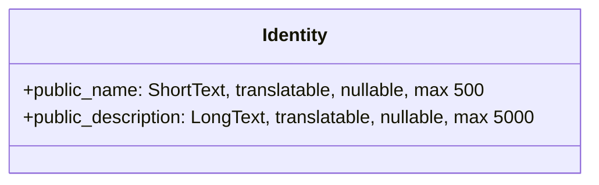
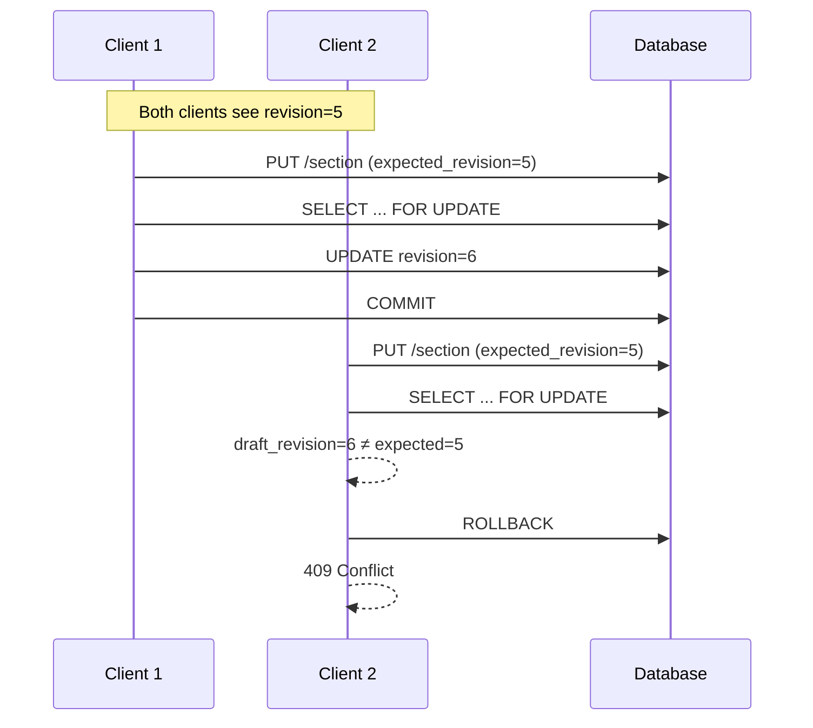
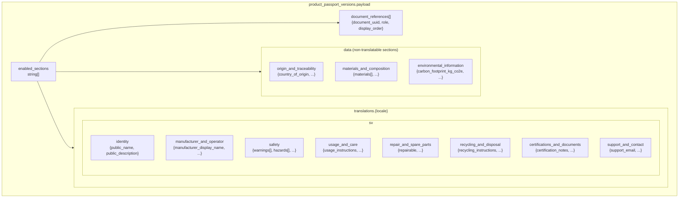
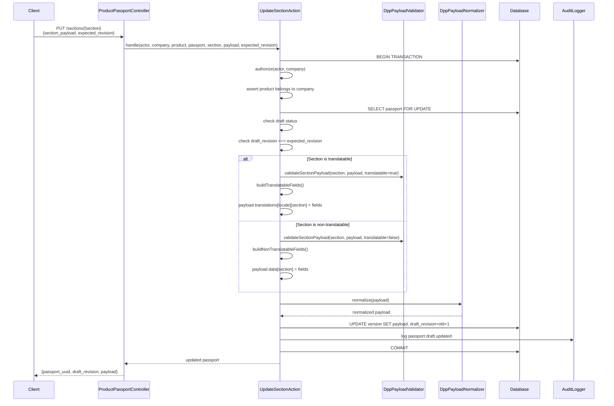
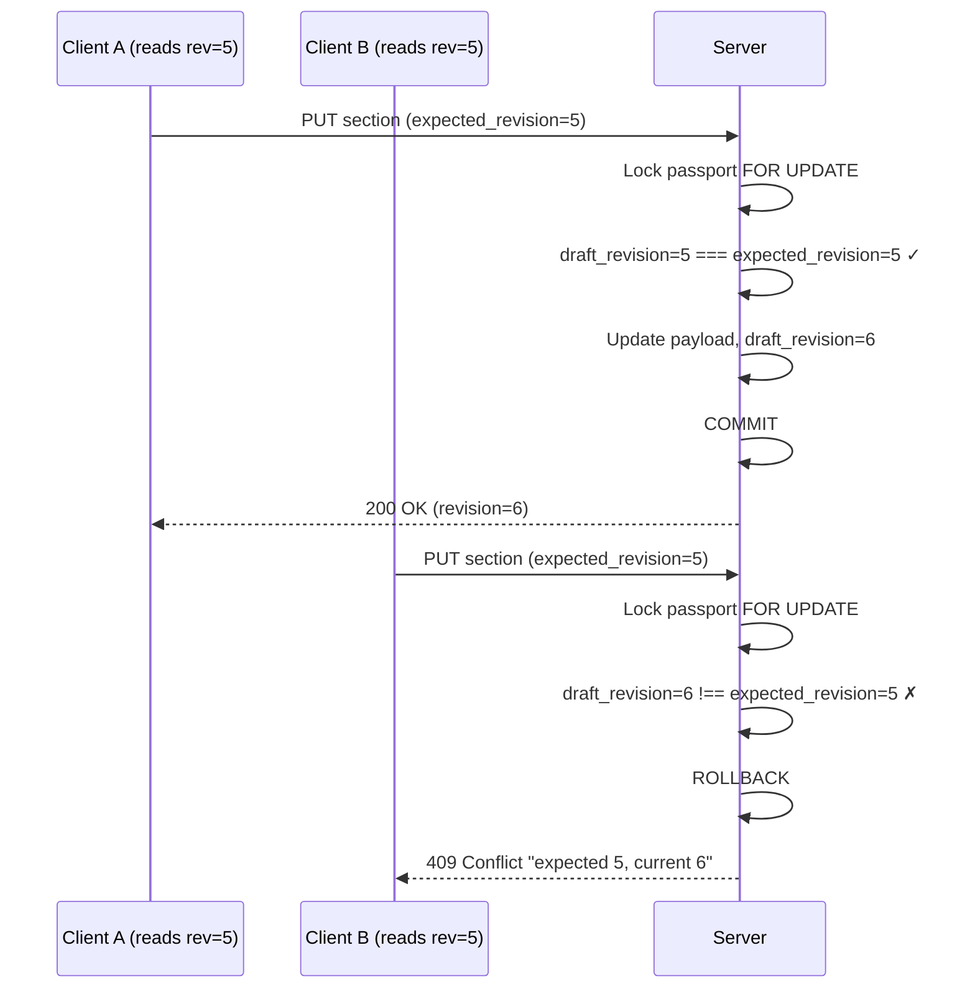

# R2.4 — DPP Data Model and Authoring

**Stage:** R2.4
**Date:** 2026-07-17
**Status:** COMPLETE
**Dependencies:** R1 Core Catalog, R2.1 Architecture, R2.2 Passport Schema, R2.3 Documents & Certificates

---

## Scope

### What R2.4 implements

- The DPP (Digital Product Passport) **schema v1** with 11 sections and 51+ fields
- A **schema registry** (`DppSchemaRegistry`) that defines field types, bounds, translatability, and core/optional status
- An **authoring layer** where draft payloads are stored as JSON in `product_passport_versions.payload`
- A **validator** (`DppPayloadValidator`) covering all field types, structural constraints, and business rules
- A **normalizer** (`DppPayloadNormalizer`) for deterministic, idempotent transformation
- **Optimistic revision control** via `draft_revision` on `ProductPassportVersion`
- **Document reference** authoring (binding product documents to passport via UUID references)
- **Catalog context** read-only provider (`DppCatalogContextProvider`)
- **Audit events**: `passport.created` and `passport.draft.updated`
- Web and API endpoints for passport CRUD, section updates, settings, and document sync

### What R2.4 defers

| Feature | Deferred to |
|---|---|
| Multi-language content authoring (only default-language `sv` is authored) | R2.9 |
| Publication (draft → immutable version) | R2.5 |
| Public-facing passport rendering (consumer website) | R2.6 |
| EAV (Entity-Attribute-Value) extensibility | N/A — never implemented |

---

## Source ADRs

- **R2-PUB-004** (Hybrid: normalized metadata + immutable JSON payload) — defines why the `payload` JSONB column stores the complete DPP content as a single immutable JSON document, while normalized metadata (status, version numbers, timestamps) lives in relational columns. See `docs/passports/R2_PUBLICATION_DECISIONS.md:146`.
- **ADR-012** (Hybrid sync+async) — defines the transaction boundary for passport mutations.
- **ADR-013** (Conflict on duplicate) — defines the optimistic concurrency strategy.
- **ADR-016** (Cache key design) — defines cache key formats for public rendering (R2.6).
- **ADR-017** (Indefinite retention; admin purge only) — defines version immutability.

---

## Authoring Architecture

### Authoring layer definition

The authoring layer is the set of classes responsible for validating, normalizing, and persisting draft DPP content. It operates exclusively on `ProductPassportVersion` records with `status = 'draft'`.

**Key classes:**

| Class | Role |
|---|---|
| `App\Services\Passports\DppSchemaRegistry` | Canonical schema definition (sections, fields, bounds) |
| `App\Services\Passports\DppPayloadValidator` | Input validation for full payloads and section payloads |
| `App\Services\Passports\DppPayloadNormalizer` | Deterministic normalization of all payload data |
| `App\Services\Passports\DppCatalogContextProvider` | Read-only catalog context for the editor UI |
| `App\Actions\Passports\CreateProductPassportDraftAction` | Atomic passport + draft version creation |
| `App\Actions\Passports\UpdateProductPassportSectionAction` | Section-level field updates |
| `App\Actions\Passports\UpdateProductPassportSettingsAction` | Enabled sections toggle |
| `App\Actions\Passports\SyncProductPassportDocumentsAction` | Document reference replacement |
| `App\Actions\Passports\ResetProductPassportSectionAction` | Clear a section's data |
| `App\Data\Passports\DppSectionDefinition` | Value object: section metadata |
| `App\Data\Passports\DppFieldDefinition` | Value object: field metadata |

### How draft payloads work

The `product_passport_versions.payload` column (JSON) contains the complete draft state:

```json
{
  "enabled_sections": ["identity", "manufacturer_and_operator", ...],
  "data": {
    "origin_and_traceability": {"country_of_origin": "SE", ...},
    "materials_and_composition": {"materials": [...], ...},
    "environmental_information": {"carbon_footprint_kg_co2e": 12.5, ...}
  },
  "translations": {
    "sv": {
      "identity": {"public_name": "My Product", ...},
      "safety": {"warnings": ["Flammable"], ...}
    }
  },
  "document_references": [
    {"document_uuid": "...", "role": "instruction", "display_order": 0}
  ]
}
```

**Storage rules:**
- `data` → non-translatable sections only (3 sections)
- `translations.{locale}` → translatable sections only (8 sections)
- `document_references` → logical UUID references to `product_documents`
- Only the default language (`sv`) is used in R2.4

### Schema version = 1

All draft versions are created with `schema_version = '1'`. This is hardcoded in `CreateProductPassportDraftAction.php:87`. When R2.5 publishes a draft, the snapshot inherits this schema version. Future schema versions (v2, v3) will coexist via immutable versioned snapshots.

### Why no EAV system was created

The DPP data model uses a **code-defined schema** (`DppSchemaRegistry`) rather than an EAV database. Reasons:
- All 11 sections and 51+ fields are known at design time
- EAV introduces query complexity, performance overhead, and type-erasure
- The `payload` JSON column provides schema flexibility (new fields can be added in the JSON without DDL changes)
- The schema is code-enforced, not database-enforced — validation logic in `DppPayloadValidator` is the single source of truth

### Why published versions are immutable

Only draft versions (`status = 'draft'`) are editable. Published/superseded/withdrawn versions are immutable per `ProductPassportVersion.php:148-192` (`isImmutable()` and `booted::updating()`). When a user needs to update a published passport, they edit the draft and re-publish (creating a new immutable version — see R2.5).

### Default-language authoring

The default language is `'sv'` (Swedish), configured via `config('passports.default_language')` in `config/passports.php`. In R2.4, all translatable content is authored in Swedish only. Multi-language support (additional locales) is deferred to R2.9.

### Catalog data boundaries

Catalog data is available **read-only** for the editor UI context. It is never auto-copied into the payload:

| Catalog field | Provided as context? | Stored in payload? |
|---|---|---|
| `product.name` | Yes (`product_name`) | No (authors use `public_name` override) |
| `product.brand` | Yes | No |
| `product.manufacturer` | Yes | No |
| `categories[].name` | Yes | No |
| `variants[].sku, .gtin, .mpn` | Yes | No |
| `attributes` | Yes | No |
| `productMedia` | Yes (`uuid`, `mime_type`) | No |

The context provider is `App\Services\Passports\DppCatalogContextProvider`. It is used in both the web controller and the API controller to enrich the editor data response.

### Document reference boundaries

Documents are referenced by **logical UUID** only:
- `document_uuid` — the UUID of the `ProductDocument`
- `role` — one of the `ProductDocumentType` enum values
- `display_order` — ordering integer

**What is NOT stored** in document references:
- `version_id` — no version pinning (always resolves to `current_version`)
- `storage_key` — no storage path exposure
- `file_name`, `mime_type` — these are resolved at render time from the document model
- `expires_at` — certificate expiry is resolved from the document, not the reference

---

## Payload Schema v1

### Top-level payload contract

```json
{
  "enabled_sections": ["identity", "manufacturer_and_operator", "safety", ...],
  "data": {
    "origin_and_traceability": { ... },
    "materials_and_composition": { ... },
    "environmental_information": { ... }
  },
  "translations": {
    "sv": {
      "identity": { ... },
      "safety": { ... }
    }
  },
  "document_references": [
    {"document_uuid": "string", "role": "string", "display_order": 0}
  ]
}
```

### Section Registry (`DppSectionKey` enum)

File: `app/Enums/Passports/DppSectionKey.php`

| # | Enum case | Value | Status | Translatable |
|---|---|---|---|---|
| 1 | `Identity` | `identity` | **Core** | Yes |
| 2 | `ManufacturerAndOperator` | `manufacturer_and_operator` | **Core** | Yes |
| 3 | `OriginAndTraceability` | `origin_and_traceability` | Optional | No |
| 4 | `MaterialsAndComposition` | `materials_and_composition` | Optional | No |
| 5 | `Safety` | `safety` | **Core** | Yes |
| 6 | `UsageAndCare` | `usage_and_care` | Optional | Yes |
| 7 | `RepairAndSpareParts` | `repair_and_spare_parts` | Optional | Yes |
| 8 | `RecyclingAndDisposal` | `recycling_and_disposal` | **Core** | Yes |
| 9 | `EnvironmentalInformation` | `environmental_information` | Optional | No |
| 10 | `CertificationsAndDocuments` | `certifications_and_documents` | Optional | Yes |
| 11 | `SupportAndContact` | `support_and_contact` | Optional | Yes |

**Core sections** (4): Identity, ManufacturerAndOperator, Safety, RecyclingAndDisposal — cannot be disabled in `enabled_sections`.
**Optional sections** (7): All others — can be toggled via settings.

### Field Types (`DppFieldType` enum)

File: `app/Enums/Passports/DppFieldType.php`

| # | Case | Value | Description |
|---|---|---|---|
| 1 | `ShortText` | `short_text` | Single-line string, max 50–500 chars depending on field |
| 2 | `LongText` | `long_text` | Multi-line string, max 5000 chars |
| 3 | `Boolean` | `boolean` | True/false |
| 4 | `Integer` | `integer` | Whole number |
| 5 | `Decimal` | `decimal` | Floating-point number |
| 6 | `Date` | `date` | ISO 8601 date (YYYY-MM-DD) |
| 7 | `Email` | `email` | RFC 5322 email address |
| 8 | `Url` | `url` | Valid URL (no credentials) |
| 9 | `CountryCode` | `country_code` | ISO 3166-1 alpha-2 (2-letter uppercase) |
| 10 | `StringList` | `string_list` | Array of strings |
| 11 | `MaterialList` | `material_list` | Array of material objects |

### All 11 Sections

Each section defined in `app/Services/Passports/DppSchemaRegistry.php`.

---

#### 1. Identity (Core, Translatable)



| Field | Type | Translatable | Nullable | Bounds |
|---|---|---|---|---|
| `public_name` | ShortText | Yes | Yes | max 500 chars |
| `public_description` | LongText | Yes | Yes | max 5000 chars |

**Transformative behavior:** These are **public identity overrides** — they override the Catalog `product.name` and `product.description` in the public-facing passport. If not set, the Catalog values are used by R2.6 rendering.

---

#### 2. ManufacturerAndOperator (Core, Translatable)

| Field | Type | Translatable | Nullable | Bounds |
|---|---|---|---|---|
| `manufacturer_display_name` | ShortText | Yes | Yes | max 500 chars |
| `responsible_operator_display_name` | ShortText | Yes | Yes | max 500 chars |
| `contact_notes` | LongText | Yes | Yes | max 5000 chars |
| `manufacturer_email` | Email | No | Yes | — |
| `manufacturer_website` | Url | No | Yes | — |
| `responsible_operator_email` | Email | No | Yes | — |
| `responsible_operator_website` | Url | No | Yes | — |
| `manufacturer_country` | CountryCode | No | Yes | — |
| `responsible_operator_country` | CountryCode | No | Yes | — |

**Transformative behavior:**
- `manufacturer_country` and `responsible_operator_country` are normalized to uppercase (e.g. `"se"` → `"SE"`)
- Email fields are lowercased
- URL credentials are stripped

---

#### 3. OriginAndTraceability (Optional, Non-Translatable)

| Field | Type | Translatable | Nullable | Bounds |
|---|---|---|---|---|
| `country_of_origin` | CountryCode | No | Yes | — |
| `manufacturing_countries` | StringList | No | Yes | max 50 items, max 3 chars each |
| `production_date` | Date | No | Yes | YYYY-MM-DD format |
| `traceability_notes` | LongText | Yes | Yes | max 5000 chars |
| `batch_identification_instructions` | LongText | Yes | Yes | max 5000 chars |

**Transformative behavior:**
- `country_of_origin` normalized to uppercase
- `manufacturing_countries` string-list deduplication (lowercase comparison), trim whitespace
- `traceability_notes` and `batch_identification_instructions` are translatable but stored ONLY in `data` (they appear in both `data` and are also available in `translations`). Wait — actually checking the schema: the section is marked as non-translatable (`private function sectionIsTranslatable(): false`). However, `traceability_notes` and `batch_identification_instructions` fields have `translatable = true`. This means they are authored in `translations.{locale}.origin_and_traceability` even though the section overall is non-translatable. Fields go to `translations` if their individual `translatable` flag is true. This is a design decision: the section classifies as non-translatable for its structural fields, but text fields within it are translatable.

---

#### 4. MaterialsAndComposition (Optional, Non-Translatable)

| Field | Type | Translatable | Nullable | Bounds |
|---|---|---|---|---|
| `materials` | MaterialList | No | Yes | max 100 items |
| `composition_notes` | LongText | Yes | Yes | max 5000 chars |

**Material item structure:**
```json
{
  "name": "string (required)",
  "percentage": 0.0-100.0,
  "recycled_content_percentage": 0.0-100.0,
  "hazardous": false,
  "country_of_origin": "SE"
}
```

**Transformative behavior:**
- Materials without a non-empty `name` are dropped
- `country_of_origin` is uppercased
- `hazardous` defaults to `false`
- Duplicate material names (case-insensitive comparison) are rejected by validator

---

#### 5. Safety (Core, Translatable)

| Field | Type | Translatable | Nullable | Bounds |
|---|---|---|---|---|
| `warnings` | StringList | Yes | Yes | max 100 items, max 1000 chars each |
| `hazards` | StringList | Yes | Yes | max 100 items, max 1000 chars each |
| `personal_protective_equipment` | StringList | Yes | Yes | max 100 items, max 1000 chars each |
| `storage_instructions` | LongText | Yes | Yes | max 5000 chars |
| `emergency_instructions` | LongText | Yes | Yes | max 5000 chars |
| `age_restrictions` | ShortText | Yes | Yes | max 500 chars |

**Transformative behavior:** StringList fields are deduplicated (case-insensitive), trimmed, and empty strings dropped.

---

#### 6. UsageAndCare (Optional, Translatable)

| Field | Type | Translatable | Nullable | Bounds |
|---|---|---|---|---|
| `usage_instructions` | LongText | Yes | Yes | max 5000 chars |
| `care_instructions` | LongText | Yes | Yes | max 5000 chars |
| `maintenance_instructions` | LongText | Yes | Yes | max 5000 chars |
| `storage_recommendations` | LongText | Yes | Yes | max 5000 chars |

---

#### 7. RepairAndSpareParts (Optional, Translatable)

| Field | Type | Translatable | Nullable | Bounds |
|---|---|---|---|---|
| `repairable` | Boolean | No | Yes | — |
| `spare_parts_available` | Boolean | No | Yes | — |
| `spare_parts_url` | Url | No | Yes | — |
| `repair_instructions` | LongText | Yes | Yes | max 5000 chars |
| `disassembly_instructions` | LongText | Yes | Yes | max 5000 chars |
| `spare_parts_notes` | LongText | Yes | Yes | max 5000 chars |
| `service_information` | LongText | Yes | Yes | max 5000 chars |

---

#### 8. RecyclingAndDisposal (Core, Translatable)

| Field | Type | Translatable | Nullable | Bounds |
|---|---|---|---|---|
| `recycling_instructions` | LongText | Yes | Yes | max 5000 chars |
| `disposal_instructions` | LongText | Yes | Yes | max 5000 chars |
| `take_back_program` | LongText | Yes | Yes | max 5000 chars |
| `recycling_codes` | StringList | No | Yes | max 50 items, max 50 chars each |

---

#### 9. EnvironmentalInformation (Optional, Non-Translatable)

| Field | Type | Translatable | Nullable | Bounds |
|---|---|---|---|---|
| `carbon_footprint_kg_co2e` | Decimal | No | Yes | min 0 |
| `recycled_content_percentage` | Decimal | No | Yes | min 0, max 100 |
| `expected_lifetime_years` | Decimal | No | Yes | min 0 |
| `energy_consumption_kwh` | Decimal | No | Yes | min 0 |
| `environmental_claims` | StringList | Yes | Yes | max 50 items, max 1000 chars each |
| `environmental_notes` | LongText | Yes | Yes | max 5000 chars |

---

#### 10. CertificationsAndDocuments (Optional, Translatable)

| Field | Type | Translatable | Nullable | Bounds |
|---|---|---|---|---|
| `certification_notes` | LongText | Yes | Yes | max 5000 chars |
| `compliance_summary` | LongText | Yes | Yes | max 5000 chars |

**Note:** This section holds narrative text about certifications and compliance. Document references (the actual PDFs) are managed separately via the `document_references` top-level key and `SyncProductPassportDocumentsAction`. Resetting this section (`ResetProductPassportSectionAction.php:85-87`) also clears `document_references`.

---

#### 11. SupportAndContact (Optional, Translatable)

| Field | Type | Translatable | Nullable | Bounds |
|---|---|---|---|---|
| `support_email` | Email | No | Yes | — |
| `support_phone` | ShortText | No | Yes | max 50 chars |
| `support_url` | Url | No | Yes | — |
| `warranty_url` | Url | No | Yes | — |
| `warranty_summary` | LongText | Yes | Yes | max 5000 chars |
| `support_notes` | LongText | Yes | Yes | max 5000 chars |

---

### Translatable vs Non-Translatable Sections

| Section | Translatable | Where stored |
|---|---|---|
| Identity | Yes | `translations.{locale}.identity` |
| ManufacturerAndOperator | Yes* | `translations.{locale}.manufacturer_and_operator`* |
| OriginAndTraceability | No** | `data.origin_and_traceability` + `translations.{locale}.origin_and_traceability`** |
| MaterialsAndComposition | No** | `data.materials_and_composition` + `translations.{locale}.materials_and_composition`** |
| Safety | Yes | `translations.{locale}.safety` |
| UsageAndCare | Yes | `translations.{locale}.usage_and_care` |
| RepairAndSpareParts | Yes* | `translations.{locale}.repair_and_spare_parts`* |
| RecyclingAndDisposal | Yes* | `translations.{locale}.recycling_and_disposal`* |
| EnvironmentalInformation | No** | `data.environmental_information` + `translations.{locale}.environmental_information`** |
| CertificationsAndDocuments | Yes | `translations.{locale}.certifications_and_documents` |
| SupportAndContact | Yes* | `translations.{locale}.support_and_contact`* |

\* Sections marked translatable contain a mix: some fields are translatable (LongText, ShortText), some are not (Email, Url, Boolean, CountryCode). Non-translatable fields within translatable sections are authored in `data`, not in `translations`.

\** Sections marked non-translatable as a whole, but individual LongText fields within them have `translatable = true`. These fields are authored in `translations.{locale}.{section_key}`. Structural fields (CountryCode, Decimal, MaterialList) stay in `data.{section_key}`.

### Catalog Source Boundaries

The `DppCatalogContextProvider` (`app/Services/Passports/DppCatalogContextProvider.php`) provides read-only context for the editor UI. This context is delivered alongside the payload in every editor data response.

**What Catalog data is available as read-only context:**

- `product_uuid`, `product_name`, `brand`, `manufacturer`, `status`
- Categories (uuid, name)
- Default variant and all variants (uuid, name, sku, gtin, mpn)
- Attribute values (uuid, definition name, value)
- Product media (uuid, mime_type)

**What Catalog data is NOT stored in the payload:**

- The `product.name` is not auto-copied — authors may use `public_name` as an override
- The `product.description` is not auto-copied — authors may use `public_description` as an override
- Catalog attribute values are never embedded in the payload
- Variant identifiers (sku, gtin, mpn) are rendered from Catalog at view time, not stored

**Public identity overrides:**

The `Identity` section fields (`public_name`, `public_description`) serve as optional overrides for the Catalog identity. If not set, the R2.6 rendering layer falls back to the Catalog values:
- `public_name` → overrides `product.name`
- `public_description` → overrides `product.description`

### Document References

**Structure:**
```json
{
  "document_uuid": "UUID of the ProductDocument",
  "role": "one of ProductDocumentType values",
  "display_order": 0
}
```

**Allowed roles** (from `App\Enums\Documents\ProductDocumentType`):

| Value | Label |
|---|---|
| `instruction` | Instruction |
| `declaration_of_conformity` | Declaration of Conformity |
| `certificate` | Certificate |
| `safety_data_sheet` | Safety Data Sheet |
| `warranty` | Warranty |
| `technical_data_sheet` | Technical Data Sheet |
| `recycling_guide` | Recycling Guide |
| `other` | Other |

**Validation rules** (in `DppPayloadValidator::validateDocumentReferences()`):
- Maximum 100 document references
- Each reference must have a valid `document_uuid`
- `role` must be a valid `ProductDocumentType` value (defaults to `other`)
- `display_order` must be a non-negative integer
- Document must belong to the same company (tenant isolation)
- Document must belong to the same product (`product_id` match)
- Document must be active (`isActive()`)
- No duplicate UUIDs in the references array

**What's NOT stored:**
- `version_id` — the reference is to the logical document; rendering resolves `current_version`
- `storage_key` — file system paths are never exposed in the payload
- `file_name`, `file_size`, `mime_type` — resolved from `ProductDocument.currentVersion` at render time
- Certificate `expires_at` — resolved from the document model, not copied

---

## Validation

All validation is implemented in `app/Services/Passports/DppPayloadValidator.php`.

### Top-level structure validation
- Only keys `enabled_sections`, `data`, `translations`, `document_references` are allowed
- Unknown top-level keys produce errors
- `enabled_sections` must be an array of strings
- `data` must be a key-value object
- `translations` must be a key-value object with valid locale keys (2-letter lowercase)
- `document_references` must be an array

### Unknown key/section/field rejection
- Unknown section keys in `data` → error
- Unknown section keys in `translations` → error
- Unknown field keys within any section → error
- Fields in translatable sections that aren't marked translatable → error
- Fields in non-translatable sections that aren't marked non-translatable → error

### Field type validation

| Type | Validation |
|---|---|
| ShortText | Must be string; max length check |
| LongText | Must be string; max length check |
| Boolean | Must be boolean |
| Integer | Must be integer; min/max bounds |
| Decimal | Must be numeric; min/max bounds |
| Date | Must match `YYYY-MM-DD` regex |
| Email | `FILTER_VALIDATE_EMAIL` |
| Url | `FILTER_VALIDATE_URL` + no credentials in URL |
| CountryCode | Must match `/^[A-Z]{2}$/` |
| StringList | Must be array; max items; each must be string with max length |
| MaterialList | Must be array; max items; each must be object |

### String length validation
- ShortText fields: max 50–500 chars depending on field definition
- LongText fields: max 5000 chars
- StringList items: max 50–1000 chars depending on field definition
- CountryCode StringList items: max 3 chars

### List size validation
- `warnings`, `hazards`, `personal_protective_equipment`: max 100 items
- `recycling_codes`: max 50 items
- `manufacturing_countries`: max 50 items
- `environmental_claims`: max 50 items
- `materials`: max 100 items
- `document_references`: max 100 items

### Number range validation
- Decimal fields with `min: 0`: `carbon_footprint_kg_co2e`, `expected_lifetime_years`, `energy_consumption_kwh`
- Decimal fields with `min: 0, max: 100`: `recycled_content_percentage`
- Material `percentage`: 0–100
- Material `recycled_content_percentage`: 0–100

### Date validation
- Format: `YYYY-MM-DD` (regex: `/^\d{4}-\d{2}-\d{2}$/`)

### Email validation
- PHP `filter_var($value, FILTER_VALIDATE_EMAIL)`

### URL validation
- PHP `filter_var($value, FILTER_VALIDATE_URL)`
- Must not contain credentials (`user` or `pass` in parsed URL)

### Country code validation
- Regex: `/^[A-Z]{2}$/` (ISO 3166-1 alpha-2, uppercase only)

### Material list validation
- `name` required, must be non-empty string
- Duplicate material names (case-insensitive) rejected
- `percentage` must be numeric 0–100
- `recycled_content_percentage` must be numeric 0–100
- `hazardous` must be boolean
- `country_of_origin` must match `/^[A-Z]{2}$/`
- Sum of all `percentage` values must not exceed 100%

### Document reference validation
- Maximum 100 references
- `document_uuid` required on each reference
- No duplicate UUIDs in the references array
- `role` must be valid `ProductDocumentType` value
- `display_order` must be non-negative integer
- Document must exist, belong to product, and be active

### Payload size limit
- Encoded JSON must not exceed **1,048,576 bytes (1 MiB)**
- Defined as `DppPayloadValidator::MAX_ENCODED_SIZE`
- Checked AFTER normalization, not before

---

## Normalization

All normalization is implemented in `app/Services/Passports/DppPayloadNormalizer.php`.

### Trimming strings
All ShortText and LongText fields are trimmed of leading/trailing whitespace.

### Empty string → null for nullable fields
If a trimmed string is empty and the field is nullable, it becomes `null`. If non-nullable, it remains `''`.

### Email lowercase
Email values are normalized to lowercase via `mb_strtolower()`.

### Country code uppercase
Country code values are normalized to uppercase via `mb_strtoupper()`.

### URL credential removal
URL credentials (`user`, `pass`) are stripped from the parsed URL before reconstruction.

### Duplicate string-list removal
StringList fields are deduplicated using case-insensitive comparison (`mb_strtolower`). Empty strings are dropped. Original casing of the first occurrence is preserved.

### Material list deduplication
Material items without a non-empty `name` are dropped. Remaining items keep their original order. Null values are stripped from each material object, and `hazardous` defaults to `false`.

### Document reference sorting
References are sorted by `display_order` ascending, then by `document_uuid` for determinism.

### Deterministic and idempotent normalization
- `enabled_sections` is sorted to canonical order and deduplicated
- All normalization is converged: `normalize(normalize(x)) === normalize(x)`
- Translations are key-sorted within each locale
- Only known section keys are retained; unknown sections are silently dropped

---

## Initial Draft Creation

### `CreateProductPassportDraftAction` workflow

File: `app/Actions/Passports/CreateProductPassportDraftAction.php`

```
1. Authorize actor (requires CompanyPermission::PassportsManage)
2. Verify company is Active
3. Verify product belongs to company (else 404)
4. Verify product is not archived
5. Lock product_passports row for update (SELECT ... FOR UPDATE)
6. If existing passport in draft state → return it (idempotent)
7. If existing passport not in draft → 409 Conflict
8. Create ProductPassport record:
   - status = 'draft'
   - default_language = config('passports.default_language') → 'sv'
   - enabled_languages = ['sv']
9. Create ProductPassportVersion record:
   - status = 'draft'
   - draft_revision = 1
   - schema_version = '1'
   - payload = normalized empty payload
10. Set current_draft_version_id on passport
11. Log audit event: passport.created
12. Commit transaction
13. Return fresh passport with currentDraftVersion relation
```

### Atomic passport + version creation
Both records are created within a single `DB::transaction()`. If any step fails, the entire transaction is rolled back.

### `current_draft_version_id` pointer set
After creating the passport and version, the passport's `current_draft_version_id` is set to the new version's `id` in a separate `save()` call within the same transaction.

### `schema_version = 1, draft_revision = 1`
Both values are hardcoded at creation. `schema_version` is a string `'1'`, not an integer.

### Default language from config
`config('passports.default_language', 'sv')` — configurability point for different default languages per deployment.

### Audit event: `passport.created`
Logged with:
- `product_uuid`
- `passport_uuid`
- `draft_version_uuid`

No full payload, no emails, no URLs are logged.

---

## Revision Control

### Expected revision mechanism
Every mutation requires an `expected_revision` parameter. This is the `draft_revision` the client last saw. The server compares it with the current `draft_revision` on the draft version.

### 409 Conflict on mismatch
If `draft_revision !== expected_revision`, the action throws `ConflictHttpException` with a message like:
```
Revision conflict: expected revision 5, current revision 7.
```
HTTP status: 409 Conflict.

### Revision increments by exactly 1 per mutation
After a successful update, `draft_revision` is incremented by exactly 1:
```php
$newRevision = $oldRevision + 1;
```

### Failed mutations don't increment revision
If validation fails or the transaction is rolled back, the revision number remains unchanged. The stale client can re-submit with the same `expected_revision`.

---

## Concurrency

### Two concurrent creates → one passport
```mermaid
sequenceDiagram
    participant C1 as Client 1
    participant C2 as Client 2
    participant DB as Database

    C1->>DB: BEGIN; SELECT ... FOR UPDATE (no row)
    C2->>DB: BEGIN; SELECT ... FOR UPDATE (waits)
    C1->>DB: INSERT passport + version
    C1->>DB: COMMIT
    C2->>DB: SELECT ... FOR UPDATE (row exists, draft)
    C2->>DB: Returns existing passport (idempotent)
    C2->>DB: ROLLBACK
```

The `lockForUpdate()` on the passport query serializes concurrent creation attempts. The second caller sees the existing draft and returns it idempotently.

### Concurrent section updates with same revision → one 409


### Sequential updates → both succeed
Two clients reading different revisions and submitting sequentially both succeed because each provides the correct `expected_revision`.

### Published versions immutable
Published, superseded, and withdrawn versions are protected by `ProductPassportVersion::booted::updating()` which throws `RuntimeException` if any field other than status transition columns is modified.

---

## Tenant Isolation

### Wrong company → 404
```php
if ((int) $product->getAttribute('company_id') !== (int) $company->getKey()) {
    throw new NotFoundHttpException;
}
```

A 404 (not 403) prevents information disclosure about the existence of resources in other companies.

### `company_id` enforced in database constraints
- `product_passports` has `UNIQUE(company_id, product_id)`
- `product_passport_versions` has `FOREIGN KEY (company_id) REFERENCES companies(id)`
- All queries use `forCompany()` scope: `ProductPassport::query()->forCompany($company)`

### All queries scoped to company
Every action, query, and controller method scopes queries to the current company. There is no cross-tenant data access path.

---

## Authorization Matrix

Based on `app/Authorization/CompanyPermissionMatrix.php`:

| Operation | Owner | Admin | Editor | Viewer |
|---|---|---|---|---|
| View passport + draft | `PassportsView` | `PassportsView` | `PassportsView` | `PassportsView` |
| Create draft | `PassportsManage` | `PassportsManage` | `PassportsManage` | — |
| Update section | `PassportsManage` | `PassportsManage` | `PassportsManage` | — |
| Update settings | `PassportsManage` | `PassportsManage` | `PassportsManage` | — |
| Sync documents | `PassportsManage` | `PassportsManage` | `PassportsManage` | — |
| Reset section | `PassportsManage` | `PassportsManage` | `PassportsManage` | — |

**API token abilities:**
- Read operations: `passports.read` (`ApiTokenAbility::PassportsRead`)
- Write operations: `passports.write` (`ApiTokenAbility::PassportsWrite`)

---

## Web Routes

All routes are in the authenticated web group with company scoping. File: `routes/web.php:154-160`.

| Method | Path | Name | Action |
|---|---|---|---|
| GET | `/{product}/passport` | `passport.show` | `show` — view passport details |
| POST | `/{product}/passport` | `passport.store` | `store` — create passport draft |
| GET | `/{product}/passport/edit` | `passport.edit` | `edit` — editor UI |
| PUT | `/{product}/passport/sections/{section}` | `passport.sections.update` | `updateSection` |
| PUT | `/{product}/passport/settings` | `passport.settings.update` | `updateSettings` |
| PUT | `/{product}/passport/documents` | `passport.documents.update` | `syncDocuments` |
| POST | `/{product}/passport/sections/{section}/reset` | `passport.sections.reset` | `resetSection` |

All product parameters use `whereUuid('product')` constraint.

---

## API Endpoints

All routes in `routes/catalog-api.php:231-252`. Controller: `App\Http\Controllers\Api\V1\Catalog\ProductPassportController`.

| # | Method | Path | Ability | Name |
|---|---|---|---|---|
| 1 | GET | `/api/v1/products/{product}/passport` | `passports.read` | `products.passport.show` |
| 2 | POST | `/api/v1/products/{product}/passport` | `passports.write` | `products.passport.store` |
| 3 | GET | `/api/v1/passports/schema` | `passports.read` | `passports.schema` |
| 4 | PUT | `/api/v1/products/{product}/passport/sections/{section}` | `passports.write` | `products.passport.sections.update` |
| 5 | PUT | `/api/v1/products/{product}/passport/settings` | `passports.write` | `products.passport.settings.update` |
| 6 | PUT | `/api/v1/products/{product}/passport/documents` | `passports.write` | `products.passport.documents.update` |
| 7 | POST | `/api/v1/products/{product}/passport/sections/{section}/reset` | `passports.write` | `products.passport.sections.reset` |
| 8 | GET | `/api/v1/passports/schema` | `passports.read` | `passports.schema` |

Rate limiting: `passports-api-read` and `passports-api-write` throttle middleware.

### Endpoint details

#### 1. GET show — Retrieve passport editor data
Returns `passport_uuid`, `status`, `default_language`, `enabled_languages`, `draft_version_uuid`, `draft_revision`, `schema_version`, `payload`, plus `context` (catalog data).

#### 2. POST store — Create passport draft
Payload: none required. Returns editor data with new draft.

#### 3. GET schema — Retrieve DPP schema
Returns all 11 sections with their field definitions, types, bounds, and translatability flags.

#### 4. PUT update section
Body: `{"section": {...}, "expected_revision": 5}`. For translatable sections, fields go under `translations.{locale}.{section}`. For non-translatable, they go under `data.{section}`.

#### 5. PUT update settings
Body: `{"settings": {"enabled_sections": [...]}, "expected_revision": 5}`. Core sections cannot be removed from `enabled_sections`.

#### 6. PUT sync documents
Body: `{"document_references": [...], "expected_revision": 5}`. Replaces the entire document references array.

#### 7. POST reset section
Body: `{"expected_revision": 5}`. Clears the section's data in both `data` and `translations`. Core sections cannot be reset. Resetting `certifications_and_documents` also clears `document_references`.

---

## OpenAPI

**Location:** `docs/api/openapi-v1.yaml`

The following passport operations are documented:
- `getProductPassport` — GET `/api/v1/products/{product}/passport`
- `createProductPassport` — POST `/api/v1/products/{product}/passport`
- `getPassportSchema` — GET `/api/v1/passports/schema`
- `updateProductPassportSection` — PUT `/api/v1/products/{product}/passport/sections/{section}`
- `updateProductPassportSettings` — PUT `/api/v1/products/{product}/passport/settings`
- `syncProductPassportDocuments` — PUT `/api/v1/products/{product}/passport/documents`
- `resetProductPassportSection` — POST `/api/v1/products/{product}/passport/sections/{section}/reset`

---

## Audit

### `passport.created` event
Logged in `CreateProductPassportDraftAction.php:97`:
```php
$this->auditLogger->logTenant(
    $freshCompany,
    AuditEvent::PassportCreated,
    $actor,
    $passport,
    [
        'product_uuid' => $product->getAttribute('uuid'),
        'passport_uuid' => $passport->getAttribute('uuid'),
        'draft_version_uuid' => $version->getAttribute('uuid'),
    ],
);
```

### `passport.draft.updated` event
Logged in all mutation actions (`UpdateSection`, `UpdateSettings`, `SyncDocuments`, `ResetSection`):
```php
$this->auditLogger->logTenant(
    $freshCompany,
    AuditEvent::PassportDraftUpdated,
    $actor,
    $passport,
    [
        'product_uuid' => ...,
        'passport_uuid' => ...,
        'draft_version_uuid' => ...,
        'section_key' => ...,  // or 'settings', or 'certifications_and_documents'
        'old_revision' => ...,
        'new_revision' => ...,
        'action' => 'reset',  // only for reset
    ],
);
```

### Safe metadata only
Audit logs contain **no**:
- Full payload content
- Email addresses from the payload
- URLs from the payload
- Document UUID references
- Any field values

Only structural metadata (UUIDs, section keys, revision numbers) are logged.

---

## Failure Behavior

### Failed validation → no audit, no payload change, no revision change
Validation throws `ValidationException` before any state modification. The transaction is rolled back, and the audit event is never logged.

### Failed transaction → complete rollback
All actions wrap logic in `DB::transaction()`. If any step throws, the `catch` block calls `DB::rollBack()` and re-throws.

### Stale revision → 409, no changes
The revision check happens after locking but before any mutation:
```php
if ($draft->draft_revision !== $expectedRevision) {
    throw new ConflictHttpException(...);
}
```
No payload changes, no audit, transaction rolled back.

---

## Database Guarantees

### `UNIQUE(company_id, product_id)` on `product_passports`
Prevents duplicate passports for the same product within a company. Defined in the R2.2 migration.

### FOREIGN KEY constraints for tenant isolation
- `product_passports.company_id` → `companies.id`
- `product_passports.product_id` → `products.id`
- `product_passport_versions.company_id` → `companies.id`
- `product_passport_versions.passport_id` → `product_passports.id`

### Immutable published/superseded/withdrawn versions
Database triggers (R2.2) prevent modification of non-draft versions. Application-level protection in `ProductPassportVersion::booted::updating()` provides a second layer:
- Published → only transitions to superseded/withdrawn by changing `status`, `superseded_at`, or `withdrawn_at`
- Superseded/Withdrawn → fully immutable (any modification throws)
- Drafts → cannot be deleted if status is not 'draft'

---

## Application Guarantees

### Actions use DB transactions
Every action (`Create`, `UpdateSection`, `UpdateSettings`, `SyncDocuments`, `ResetSection`) wraps its logic in `DB::beginTransaction()` / `DB::commit()` / `DB::rollBack()`.

### Optimistic revision control
Every mutation action:
1. Locks the passport row (`lockForUpdate()`)
2. Reads `currentDraftVersion.draft_revision`
3. Compares with `expected_revision`
4. If mismatch → throws 409
5. If match → mutates, increments revision by 1, commits

### Section-level atomic updates
Each section update (translatable or non-translatable) is a committed transaction. Only the target section is modified; other sections, translations, and document references are untouched. The normalizer is applied to the full payload after modification to ensure consistency.

---

## Testing

### Test Profiles

| Test file | Profile | Type |
|---|---|---|
| `tests/Unit/Passports/Dpp/DppSchemaRegistryTest.php` | Schema definition integrity | Unit |
| `tests/Unit/Passports/Dpp/DppPayloadValidatorTest.php` | Validation logic | Unit |
| `tests/Unit/Passports/Dpp/DppPayloadNormalizerTest.php` | Normalization logic | Unit |
| `tests/Feature/Passports/Authoring/DppAuthoringTest.php` | Full authoring workflow | Feature |
| `tests/Feature/Passports/Audit/DppAuditTest.php` | Audit event logging | Feature |
| `tests/Feature/Passports/Security/DppSecurityTest.php` | Authorization & tenant isolation | Feature |
| `tests/Feature/Passports/Concurrency/DppConcurrencyTest.php` | Concurrent operations | Feature |
| `tests/Concurrency/DppConcurrencyTest.php` | Race condition testing | Concurrency |
| `tests/Feature/Api/V1/Passports/DppApiTest.php` | API endpoint integration | Feature |

### Key test scenarios (from `DppAuthoringTest`):
- **Create draft**: Verifies `schema_version = '1'`, `draft_revision = 1`, default language = `'sv'`, empty payload structure, `current_draft_version_id` set, audit event `passport.created`
- **Update translatable section**: Updates `usage_and_care` fields → appears in `translations.sv.usage_and_care`
- **Update non-translatable section**: Updates `origin_and_traceability` fields → appears in `data.origin_and_traceability`
- **Update translatable + non-translatable in same section**: Safety section has both translatable fields (go to `translations`) and non-translatable (N/A for safety — all its fields are translatable)
- **Revision conflict**: Sends stale `expected_revision` → 409
- **Revision increments**: Sequential section updates increment revision by exactly 1 each
- **Enabled sections toggle**: Can disable optional sections, cannot disable core sections
- **Reset optional section**: Clears section data from both `data` and `translations`; resets revision
- **Reset core section**: Rejected with error
- **Document reference sync**: Replaces `document_references` array
- **Validation rejection**: Unknown sections, bad types, oversized payloads → 422 errors

### Test scenarios (from `DppSecurityTest`):
- Wrong company → 404
- Viewer cannot create/manage passports
- Editor can create/manage passports
- Cross-company access blocked

### Test scenarios (from `DppConcurrencyTest`):
- Two concurrent creates → one passport, second idempotent
- Concurrent section updates with same revision → one 409
- Sequential updates → both succeed

---

## CI

CI blocking profiles (added during R2.4 implementation):

| Test Suite | CI Status |
|---|---|
| `tests/Unit/Passports/Dpp/DppSchemaRegistryTest.php` | Blocking |
| `tests/Unit/Passports/Dpp/DppPayloadValidatorTest.php` | Blocking |
| `tests/Unit/Passports/Dpp/DppPayloadNormalizerTest.php` | Blocking |
| `tests/Feature/Passports/Authoring/DppAuthoringTest.php` | Blocking |
| `tests/Feature/Passports/Audit/DppAuditTest.php` | Blocking |
| `tests/Feature/Passports/Security/DppSecurityTest.php` | Blocking |
| `tests/Feature/Passports/Concurrency/DppConcurrencyTest.php` | Blocking |
| `tests/Feature/Api/V1/Passports/DppApiTest.php` | Blocking |

All DPP tests are blocking in CI. Failure in any of these suites prevents merge.

---

## Deferred Behavior

| Behavior | Deferred to | Reason |
|---|---|---|
| Multi-language content authoring (additional locales beyond `sv`) | R2.9 | Pilot scope: Swedish first |
| Publication workflow (draft → immutable published version) | R2.5 | Separate concern: publication domain |
| Public-facing passport rendering (consumer website) | R2.6 | Separate concern: rendering layer |
| Passport version history UI | R2.5 | Built on publication history |
| Public identity fallback rendering (Catalog `product.name` → `public_name`) | R2.6 | Rendering-time concern |
| Document version resolution for public rendering | R2.6 | Resolving `current_version` at render time |
| PDF generation of passport | R2.6 | Export feature |
| Caching of published passport snapshots | R2.6 | Infrastructure concern |
| EAV/extensible fields beyond 11 defined sections | N/A | Not in scope; schema is code-defined |

---

## Operational Troubleshooting

| Issue | Cause | Resolution |
|---|---|---|
| **409 Revision conflict** | Another client modified the draft since the last read | Re-fetch payload with current `draft_revision`, re-apply changes, re-submit |
| **422 Unknown section** | Section key typo or schema version mismatch | Ensure section key matches `DppSectionKey` values exactly (snake_case) |
| **422 Core section cannot be disabled** | Attempted to remove a core section from `enabled_sections` | Core sections (identity, manufacturer_and_operator, safety, recycling_and_disposal) are always required |
| **422 Payload too large** | Encoded JSON exceeds 1 MiB | Reduce content; check for excessive material list entries or large text fields |
| **422 Material sum exceeds 100%** | Material percentages add up to >100% | Adjust percentages to sum ≤ 100% |
| **404 after passport creation** | Product's `company_id` doesn't match current company | Verify tenant context; check `company_id` on product |
| **Draft not found** | Passport was published or draft was deleted | Create new draft via POST store endpoint |
| **Empty payload after update** | Translatable section updated with non-translatable data or vice versa | Check section's translatability in schema; translatable fields go in section data, non-translatable in `data` |
| **Duplicate document reference UUID** | Same document added twice | Remove duplicates; each document can only appear once |
| **Document not found/not active** | Referenced document is archived or doesn't belong to product | Verify document exists, is active, and belongs to the same product |

---

## Diagrams

### 1. Payload Structure



### 2. Authoring Update Sequence



### 3. Optimistic Revision Conflict



### 4. Catalog/Document Source Boundaries

```mermaid
graph LR
    subgraph Catalog["R1 Catalog (Read-Only Source)"]
        P["Product<br/>name, brand, manufacturer"]
        V["Variants<br/>sku, gtin, mpn"]
        A["Attributes<br/>definition, value"]
        M["Media<br/>uuid, mime_type"]
        C["Categories<br/>uuid, name"]
    end

    subgraph Documents["R2.3 Documents (Logical Source)"]
        PD["ProductDocument<br/>uuid, status"]
        PDV["ProductDocumentVersion<br/>file, mime_type"]
    end

    subgraph DPP["R2.4 DPP Payload"]
        direction TB
        PAYLOAD["product_passport_versions.payload"]
        PUBLIC["public_name<br/>public_description<br/>(overrides)"]
        DR["document_references[]<br/>(logical UUID only)"]
    end

    Catalog -->|context provider<br/>read-only| DPP
    Documents -->|UUID reference<br/>no version pinning| DR
    PUBLIC -.->|overrides| P
    DR -.->|resolved at render time (R2.6)| PDV
```

---

## References

- **R2 Pilot Scope:** [R2_PILOT_SCOPE.md](R2_PILOT_SCOPE.md)
- **R2 Publication Domain:** [R2_PUBLICATION_DOMAIN.md](R2_PUBLICATION_DOMAIN.md)
- **R2 Publication Decisions:** [R2_PUBLICATION_DECISIONS.md](R2_PUBLICATION_DECISIONS.md)
- **R2 Passport Schema:** [R2_PASSPORT_SCHEMA.md](R2_PASSPORT_SCHEMA.md)
- **R2 Documents & Certificates:** [R2_DOCUMENTS_AND_CERTIFICATES.md](R2_DOCUMENTS_AND_CERTIFICATES.md)
