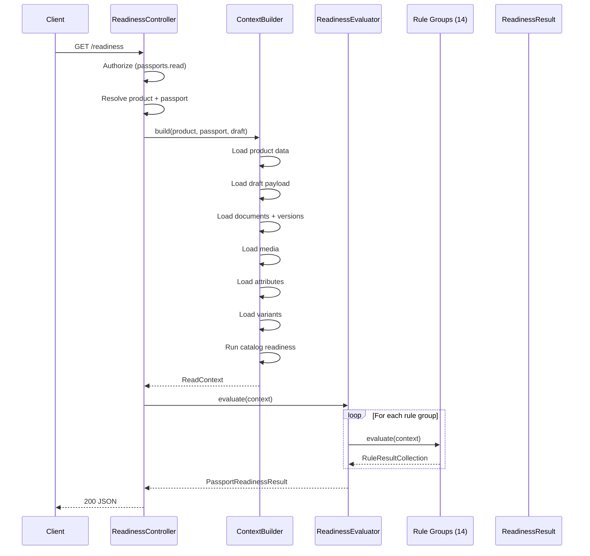
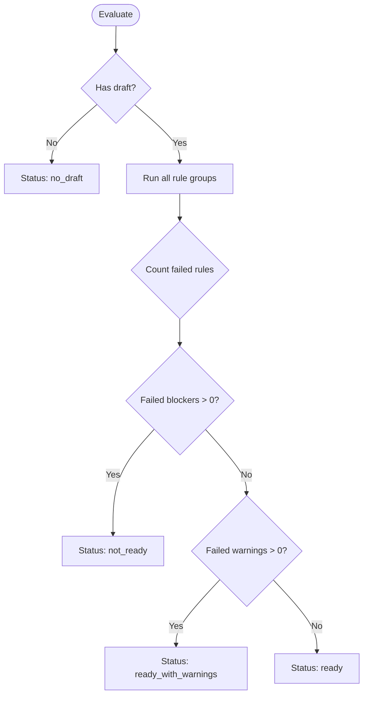
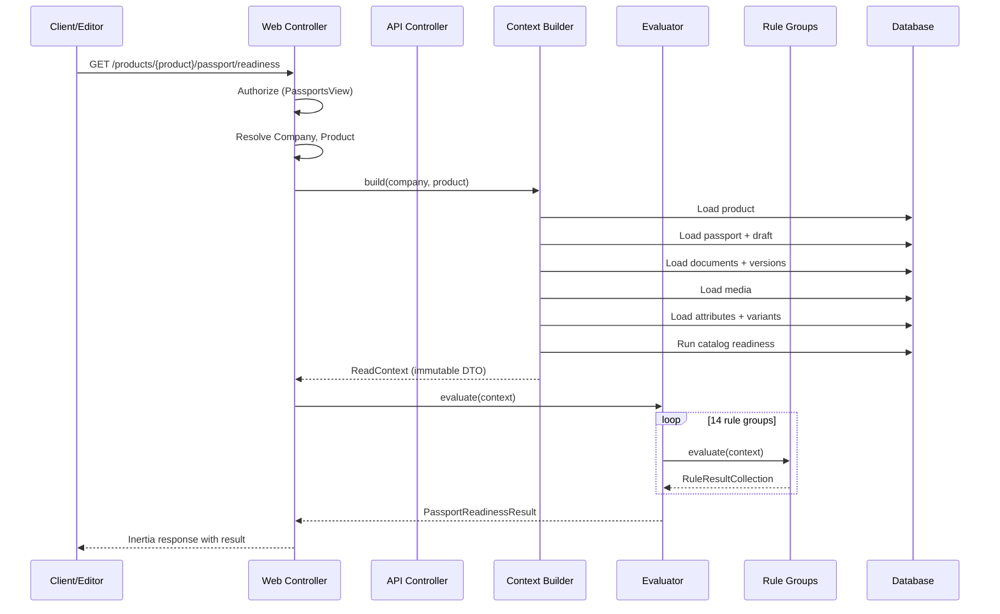
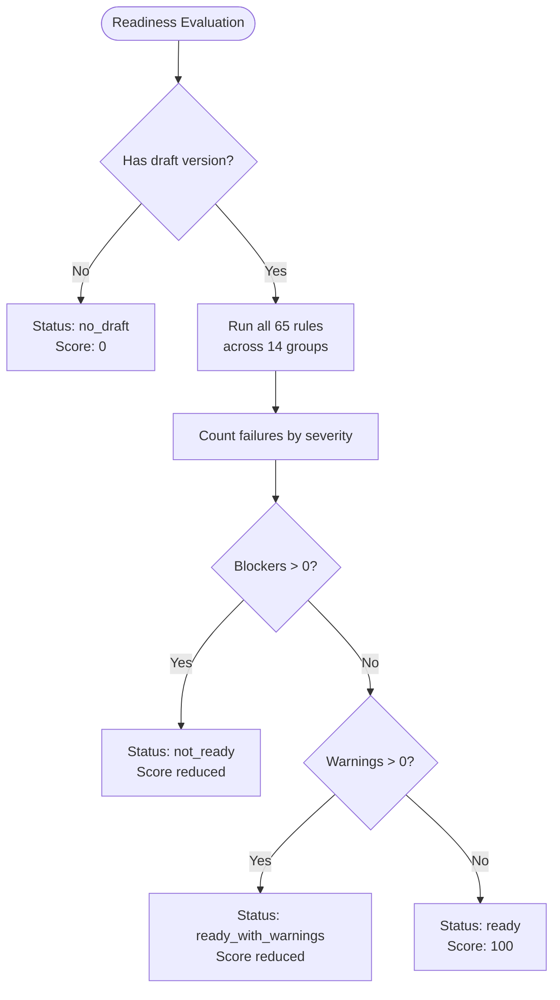
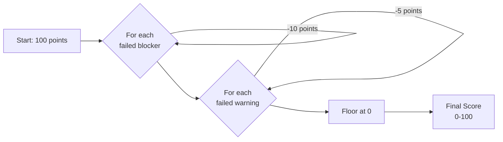

# NordiPass R2 — DPP Readiness

**Stage:** R2.5
**Date:** 2026-07-17
**Status:** COMPLETE
**Dependencies:** R1 Core Catalog, R2.1 Architecture, R2.2 Passport Schema, R2.3 Documents & Certificates, R2.4 DPP Data Model

---

## Scope

R2.5 implements the Product Passport Readiness evaluation module. Readiness evaluates whether a passport draft contains all required content for publication. It is **operational validation, not legal certification**.

### What R2.5 implements

- A structured readiness engine: context builder → evaluator pipeline → result
- 65 rules across 14 rule groups evaluating catalog data, DPP sections, documents, certificates, media, and passport metadata
- Three severity levels: blocker, warning, recommendation
- Four rule statuses: passed, failed, not_applicable, skipped
- A weighted scoring formula producing a 0–100 readiness score
- Navigation targets linking rules to the exact UI form that can resolve them
- Deterministic, read-only evaluation with no side effects
- Web endpoint: `/products/{product}/passport/readiness`
- API endpoint: `GET /api/v1/products/{product}/passport/readiness`
- Authorization via `passports.read` ability and `PassportsView` company permission

### What R2.5 defers

| Feature | Deferred to |
|---|---|
| Readiness as a gate blocking publication | R2.6 (Publication) |
| Multi-language content validation (only sv is evaluated) | R2.9 |
| Visual readiness dashboard with charts | R2.6 |
| Passport list filtering by readiness status (ready/not_ready) | R2.6 |
| Scheduled readiness snapshots | R3 |

---

## Operational-Not-Legal Disclaimer

Readiness is an **operational tool** for passport editors. It evaluates whether required data is present and well-formed. It does NOT:

- Certify regulatory compliance
- Guarantee legal validity of published passports
- Replace legal review of DPP content
- Validate the substantive correctness of manufacturer claims

A passport that passes readiness may still contain incorrect information. A passport that fails readiness may still satisfy legal requirements. Readiness gates publication in the platform workflow but imposes no regulatory effect.

---

## Readiness Profile

| Attribute | Value |
|---|---|
| **Profile ID** | `nordipass-pilot` |
| **Profile Version** | `1` |
| **Schema Version** | `1` |
| **Description** | NordiPass pilot readiness profile evaluating catalog data, DPP sections, documents, certificates, media, and metadata for operational publication readiness |

The profile identifier is included in every readiness result to allow clients to detect profile changes and to support future alternative profiles (e.g., a stricter EU DPP compliance profile in R3).

---

## Architecture

### Three-Phase Evaluation Pipeline

```
Catalog Product + Passport Draft
        │
        ▼
┌───────────────────────┐
│ 1. Context Builder    │  Reads all necessary data (product, passport, draft,
│   (ReadContextBuilder) │  documents, media, attributes, variants, catalog readiness)
└───────┬───────────────┘
        │ ReadContext DTO (immutable snapshot of current state)
        ▼
┌───────────────────────┐
│ 2. Evaluator          │  Iterates all registered rule groups.
│   (ReadinessEvaluator)│  Each group evaluates zero or more rules against the context.
│                       │  Collects results into a RuleResultCollection.
└───────┬───────────────┘
        │ RuleResultCollection
        ▼
┌───────────────────────┐
│ 3. Result Builder     │  Counts by severity/status, computes score,
│   (ReadinessResult)   │  assembles final PassportReadinessResult DTO.
└───────────────────────┘
```



### Key Classes

| Class | Role |
|---|---|
| `App\Services\Passports\Readiness\ReadContextBuilder` | Assembles the `ReadContext` DTO from product, passport, draft, documents, media, attributes, and catalog readiness |
| `App\Services\Passports\Readiness\ReadinessEvaluator` | Orchestrates all rule groups, collects results, builds the final `PassportReadinessResult` |
| `App\Data\Passports\Readiness\ReadContext` | Immutable value object holding all data needed for evaluation |
| `App\Data\Passports\Readiness\PassportReadinessResult` | Final result DTO with status, score, counts, and rule items |
| `App\Data\Passports\Readiness\ReadinessCounts` | Counts by severity and status |
| `App\Data\Passports\Readiness\ReadinessRuleItem` | Single rule evaluation result |
| `App\Data\Passports\Readiness\ReadinessNavigationTarget` | Points to the UI form that can resolve the rule |
| `App\Services\Passports\Readiness\Rules\*` | 14 rule group classes (one per group) |

---

## Evaluation Context

The `ReadContext` DTO is an immutable snapshot of all data relevant to readiness evaluation. It is built once per request and shared across all rule groups.

### Context Data

| Property | Type | Source |
|---|---|---|
| `product` | Product model | `products` table |
| `passport` | ProductPassport model | `product_passports` table |
| `draftVersion` | ProductPassportVersion model | `product_passport_versions` (status = draft) |
| `draftPayload` | array | `draftVersion.payload` (decoded JSON) |
| `documents` | Collection\<ProductDocument\> | `product_documents` (status = active) |
| `documentVersions` | Collection\<keyed by document_uuid → current version\> | `product_document_versions` |
| `media` | Collection\<ProductMedia\> | `product_media` |
| `attributes` | Collection\<keyed by definition_uuid → value\> | `product_attribute_values` |
| `variants` | Collection\<ProductVariant\> | `product_variants` |
| `catalogReadiness` | array (from ProductActivationReadinessService) | R1 catalog readiness evaluation |
| `enabledLanguages` | array | `passport.enabled_languages` |
| `defaultLanguage` | string | `passport.default_language` |

### Context Building Rules

- Context is built once, outside any transaction, with no locks
- Reading stale data is acceptable (readiness is advisory, not transactional)
- Missing draft returns readiness with `status = no_draft`
- Missing passport returns `404 Not Found`
- Product must belong to the authenticated company (tenant isolation)

---

## Result Contract

### `PassportReadinessResult`

```json
{
  "profile": "nordipass-pilot",
  "profile_version": "1",
  "schema_version": "1",
  "passport_uuid": "01JN5QZ8K7X2W3Y4R5T6U7V8A",
  "draft_version_uuid": "01JN5QZ8K7X2W3Y4R5T6U7V8B",
  "passport_revision": 14,
  "status": "not_ready",
  "score": 72,
  "counts": {
    "passed": 48,
    "blockers": 2,
    "warnings": 4,
    "recommendations": 3,
    "not_applicable": 8
  },
  "rules": [...],
  "evaluated_at": "2026-07-17T14:30:00+02:00"
}
```

### `ReadinessCounts`

| Field | Description |
|---|---|
| `passed` | Rules that passed |
| `blockers` | Rules with severity = blocker that failed |
| `warnings` | Rules with severity = warning that failed |
| `recommendations` | Rules with severity = recommendation that failed |
| `not_applicable` | Rules that were not applicable to this passport |

### `ReadinessRuleItem`

```json
{
  "code": "catalog.product.missing_brand",
  "group": "catalog",
  "severity": "warning",
  "status": "failed",
  "title_key": "readiness.rules.catalog.product.missing_brand.title",
  "message_key": "readiness.rules.catalog.product.missing_brand.message",
  "section": null,
  "field": null,
  "navigation_target": {
    "type": "route",
    "section": null,
    "route_name": "products.edit",
    "route_parameters": {"product": "01JN..."},
    "label": "Edit Product"
  },
  "safe_context": {}
}
```

### `ReadinessNavigationTarget`

| Field | Description |
|---|---|
| `type` | `route` (Inertia route), `dpp_section` (DPP editor section), `document_list`, `media_list`, or `none` |
| `section` | DPP section key if type is `dpp_section` |
| `route_name` | Named Inertia route |
| `route_parameters` | Route parameters object |
| `label` | Human-readable label for the navigation link |

### Safe Context

The `safe_context` field on each rule item is an empty object (reserved for future use). It must never contain:
- Raw payload content
- Email addresses
- URLs from the payload
- Storage paths
- Document binary references
- Any sensitive data

---

## Statuses and Decision Logic

### Overall Readiness Status

| Status | Condition |
|---|---|
| `ready` | Zero failed blockers AND zero failed warnings |
| `ready_with_warnings` | Zero failed blockers AND at least one failed warning |
| `not_ready` | One or more failed blockers |
| `no_draft` | Passport has no draft version |
| `no_passport` | Product has no passport (API returns 404 in this case) |



### Rule Statuses

| Status | Meaning |
|---|---|
| `passed` | The condition checked by the rule is satisfied |
| `failed` | The condition checked by the rule is not satisfied |
| `not_applicable` | The rule does not apply to this passport (e.g., recycling rules for a non-physical product) |
| `skipped` | The rule was skipped due to a dependency failure (e.g., document expiry check skipped because required document is missing) |

---

## Severities

| Severity | Label | Description | Blocks Publication? | Affects Score? |
|---|---|---|---|---|
| `blocker` | Blocker | Must be resolved before publication. Indicates missing mandatory data. | Yes (R2.6) | Yes — each blocker is -10 points |
| `warning` | Warning | Should be addressed. Indicates missing recommended data or best-practice gaps. | No | Yes — each warning is -5 points |
| `recommendation` | Recommendation | Optional improvement. Advisory only. | No | No — informational only |

---

## Scoring Formula

The readiness score is an integer from 0 to 100.

### Formula

```
score = max(0, 100 - (failed_blockers × 10) - (failed_warnings × 5))
```

- Maximum possible score: 100
- Minimum possible score: 0 (capped — score never goes below zero)
- Recommendations do not affect the score
- Not applicable and skipped rules do not affect the score
- Passed rules do not affect the score (they confirm goodness, not add points)

### Example

```
Rules evaluated: 65
  Passed:           48
  Failed blockers:   2  →  -20 points
  Failed warnings:   4  →  -20 points
  Recommendations:   3  →    0 points
  Not applicable:    8  →    0 points

Score = 100 - 20 - 20 = 60
```

```mermaid
flowchart LR
    SCORE[Score = 100]
    SCORE --> B1["-10 per failed blocker"]
    SCORE --> W1["-5 per failed warning"]
    B1 --> RESULT[max\(0, result\)]
    W1 --> RESULT
```

---

## Rule Groups

| # | Group Key | Rules | Description |
|---|---|---|---|
| 1 | `catalog` | 9 | Product data completeness in R1 Catalog |
| 2 | `passport_technical` | 12 | Passport metadata, draft state, schema version |
| 3 | `identity` | 3 | DPP Identity section (public_name, public_description) |
| 4 | `manufacturer` | 4 | DPP ManufacturerAndOperator section |
| 5 | `safety` | 3 | DPP Safety section |
| 6 | `recycling` | 3 | DPP RecyclingAndDisposal section |
| 7 | `materials` | 4 | DPP MaterialsAndComposition section |
| 8 | `environmental` | 3 | DPP EnvironmentalInformation section |
| 9 | `usage_care_repair` | 5 | DPP UsageAndCare and RepairAndSpareParts sections |
| 10 | `support` | 2 | DPP SupportAndContact section |
| 11 | `media` | 5 | Product media (images) |
| 12 | `document_reference` | 6 | Document references in passport |
| 13 | `certificate` | 5 | Certificate-specific validation |

---

## All Rules

### Catalog Rules (9)

| # | Code | Severity | Description |
|---|---|---|---|
| 1 | `catalog.product.missing_name` | blocker | Product name is empty (falls back to Catalog) |
| 2 | `catalog.product.missing_brand` | warning | Brand field is empty |
| 3 | `catalog.product.missing_manufacturer` | blocker | Manufacturer field is empty |
| 4 | `catalog.product.missing_short_description` | warning | Short description is empty |
| 5 | `catalog.product.missing_description` | warning | Long description is empty |
| 6 | `catalog.product.missing_primary_category` | warning | No primary category assigned |
| 7 | `catalog.product.missing_default_variant` | warning | No default variant set |
| 8 | `catalog.product.missing_sku` | warning | Default variant has no SKU |
| 9 | `catalog.product.missing_gtin` | warning | Default variant has no GTIN |

Catalog rules delegate to R1 `ProductActivationReadinessService` where applicable. Rules 1–9 are evaluated against the catalog product, not the passport. Catalog readiness blockers (product not active, missing required attributes) surface as passport readiness blockers.

### Passport Technical Rules (12)

| # | Code | Severity | Description |
|---|---|---|---|
| 1 | `passport.no_draft` | blocker | Passport has no draft version |
| 2 | `passport.product_not_active` | blocker | Product status is not `active` |
| 3 | `passport.product_not_catalog_ready` | blocker | Product fails catalog readiness (has catalog blockers) |
| 4 | `passport.missing_default_language` | blocker | Default language is not set on passport |
| 5 | `passport.missing_enabled_languages` | warning | No enabled languages configured |
| 6 | `passport.missing_english` | warning | English is not in enabled languages (required for pilot) |
| 7 | `passport.schema_version_mismatch` | warning | Draft schema version differs from current schema version |
| 8 | `passport.draft_revision_zero` | warning | Draft has never been edited (revision = 0) |
| 9 | `passport.empty_enabled_sections` | blocker | No sections enabled (minimum: 4 core sections) |
| 10 | `passport.core_section_disabled` | blocker | A core section is missing from enabled_sections |
| 11 | `passport.payload_empty` | blocker | Payload is completely empty |
| 12 | `passport.payload_too_large` | blocker | Payload exceeds 1 MB size limit |

### Identity Rules (3)

| # | Code | Severity | Description |
|---|---|---|---|
| 1 | `identity.missing_public_name` | warning | public_name is empty in default language |
| 2 | `identity.missing_public_description` | warning | public_description is empty in default language |
| 3 | `identity.section_disabled` | blocker | Identity section (core) is not in enabled_sections |

### Manufacturer Rules (4)

| # | Code | Severity | Description |
|---|---|---|---|
| 1 | `manufacturer.missing_display_name` | blocker | manufacturer_display_name is empty in default language |
| 2 | `manufacturer.missing_country` | warning | manufacturer_country is not set |
| 3 | `manufacturer.missing_email` | warning | manufacturer_email is not set |
| 4 | `manufacturer.section_disabled` | blocker | Manufacturer section (core) is not in enabled_sections |

### Safety Rules (3)

| # | Code | Severity | Description |
|---|---|---|---|
| 1 | `safety.empty_warnings_and_hazards` | blocker | Both warnings and hazards string lists are empty in default language |
| 2 | `safety.missing_ppe` | warning | personal_protective_equipment is empty |
| 3 | `safety.section_disabled` | blocker | Safety section (core) is not in enabled_sections |

### Recycling Rules (3)

| # | Code | Severity | Description |
|---|---|---|---|
| 1 | `recycling.empty_instructions` | blocker | Both recycling_instructions and disposal_instructions are empty in default language |
| 2 | `recycling.missing_take_back` | warning | take_back_program is empty |
| 3 | `recycling.section_disabled` | blocker | Recycling section (core) is not in enabled_sections |

### Materials Rules (4)

| # | Code | Severity | Description |
|---|---|---|---|
| 1 | `materials.empty_list` | warning | Materials list is empty |
| 2 | `materials.percentage_sum` | warning | Material percentages do not sum to 100% |
| 3 | `materials.missing_hazardous_flag` | warning | No materials flagged as hazardous (may be correct, but prompts review) |
| 4 | `materials.single_material` | recommendation | Only one material defined (consider adding detail) |

### Environmental Rules (3)

| # | Code | Severity | Description |
|---|---|---|---|
| 1 | `environmental.missing_carbon_footprint` | recommendation | carbon_footprint_kg_co2e is not set |
| 2 | `environmental.missing_recycled_content` | recommendation | recycled_content_percentage is not set |
| 3 | `environmental.missing_lifetime` | recommendation | expected_lifetime_years is not set |

### Usage / Care / Repair Rules (5)

| # | Code | Severity | Description |
|---|---|---|---|
| 1 | `usage.missing_instructions` | warning | usage_instructions is empty in default language |
| 2 | `usage.missing_care` | warning | care_instructions is empty in default language |
| 3 | `usage.missing_repairable_flag` | recommendation | repairable boolean is not set |
| 4 | `usage.missing_spare_parts_flag` | recommendation | spare_parts_available boolean is not set |
| 5 | `usage.missing_repair_instructions` | warning | repair_instructions is empty (when repairable is true) |

### Support Rules (2)

| # | Code | Severity | Description |
|---|---|---|---|
| 1 | `support.missing_email` | warning | support_email is not set |
| 2 | `support.missing_url` | warning | support_url is not set |

### Media Rules (5)

| # | Code | Severity | Description |
|---|---|---|---|
| 1 | `media.no_images` | warning | No product images uploaded |
| 2 | `media.no_primary` | warning | No primary image set |
| 3 | `media.missing_alt_text` | warning | Primary image has no alt text in default language |
| 4 | `media.only_one_image` | recommendation | Only one product image (consider adding more) |
| 5 | `media.low_resolution` | warning | Primary image is below 800x800 pixels |

### Document Reference Rules (6)

| # | Code | Severity | Description |
|---|---|---|---|
| 1 | `document_reference.no_documents` | warning | No document references in passport |
| 2 | `document_reference.missing_instruction` | warning | No instruction document referenced |
| 3 | `document_reference.missing_declaration` | warning | No declaration_of_conformity referenced |
| 4 | `document_reference.missing_sds` | warning | No safety_data_sheet referenced |
| 5 | `document_reference.missing_recycling_guide` | warning | No recycling_guide referenced |
| 6 | `document_reference.stale_reference` | blocker | Referenced document is archived or not found |

### Certificate Rules (5)

| # | Code | Severity | Description |
|---|---|---|---|
| 1 | `certificate.missing_certificate` | warning | No certificate document referenced |
| 2 | `certificate.expired` | blocker | A referenced certificate has expired |
| 3 | `certificate.expiring_soon` | warning | A referenced certificate expires within 30 days |
| 4 | `certificate.missing_issuer` | warning | A certificate has no issuer_name |
| 5 | `certificate.missing_issue_date` | warning | A certificate has no issue_date |

---

## Navigation Targets

Each rule that fails includes a `navigation_target` pointing the user to the UI form that can resolve the issue.

| Rule Group | Navigation Type | Target |
|---|---|---|
| Catalog rules | `route` | `products.edit` — product edit form |
| Passport technical rules | `route` | `passport.edit` — passport editor |
| Identity rules | `dpp_section` | Section `identity` in DPP editor |
| Manufacturer rules | `dpp_section` | Section `manufacturer_and_operator` in DPP editor |
| Safety rules | `dpp_section` | Section `safety` in DPP editor |
| Recycling rules | `dpp_section` | Section `recycling_and_disposal` in DPP editor |
| Materials rules | `dpp_section` | Section `materials_and_composition` in DPP editor |
| Environmental rules | `dpp_section` | Section `environmental_information` in DPP editor |
| Usage/care/repair rules | `dpp_section` | Section `usage_and_care` or `repair_and_spare_parts` |
| Support rules | `dpp_section` | Section `support_and_contact` in DPP editor |
| Media rules | `media_list` | Product media management page |
| Document reference rules | `document_list` | Product documents page |
| Certificate rules | `document_list` | Product documents page (filtered to certificates) |

---

## Determinism and Read-Only Guarantee

### Determinism

Readiness evaluation is **deterministic**: running the same evaluation against the same passport draft at the same point in time always produces the same result. Determinism is ensured by:

- Rule groups are evaluated in a fixed order
- Rules within groups are evaluated in a fixed order
- No randomness, no sampling, no probabilistic thresholds
- No external service calls
- No system clock dependency (certificate expiry is evaluated against the current date, which is deterministic within a single request)

### Read-Only Guarantee

Readiness evaluation is **read-only**:

- No database writes
- No mutations to passport, draft, product, or any related entity
- No audit events are logged
- No cache state is modified
- No queue jobs are dispatched
- No file system operations

Readiness can be called as often as desired without any side effects.

---

## Authorization Matrix

| Operation | Permission | API Ability |
|---|---|---|
| View readiness | `PassportsView` | `passports.read` |

All users with passport view access can view readiness. No special readiness-specific permission is required. Readiness is a read operation on the passport, not a separate permission domain.

### Web

| Method | Route | Name | Permission |
|---|---|---|---|
| GET | `/products/{product}/passport/readiness` | `passport.readiness` | `PassportsView` |

### API

| Method | Route | Ability |
|---|---|---|
| GET | `/api/v1/products/{product}/passport/readiness` | `passports.read` |

---

## Web and API Endpoints

### Web Endpoint

```
GET /products/{product}/passport/readiness
Name: passport.readiness
Controller: App\Http\Controllers\Passports\PassportReadinessController@show
```

Returns an Inertia response with the readiness result for display in the passport editor. The web response includes:
- The full `PassportReadinessResult`
- Catalog context for the editor sidebar
- Navigation target resolution (route names and parameters for Inertia)

### API Endpoint

```
GET /api/v1/products/{product}/passport/readiness
OperationId: getProductPassportReadiness
Controller: App\Http\Controllers\Api\V1\Passports\PassportReadinessApiController
```

Returns JSON matching the `PassportReadinessResult` schema. No wrapper — the result is returned directly (unlike other API resources which use a `{data, meta, error}` envelope).

The API response includes route names and parameters for navigation targets, but clients are responsible for resolving these into their own UI navigation.

---

## OpenAPI

Documented in `docs/api/openapi-v1.yaml`:

- Path: `/products/{product}/passport/readiness` (GET)
- Schemas: `PassportReadinessResult`, `ReadinessCounts`, `ReadinessRuleItem`, `ReadinessNavigationTarget`
- Response: `PassportReadinessResponse`

---

## Failure Handling

| Scenario | Behavior |
|---|---|
| Product not found | 404 Not Found |
| Product belongs to wrong company | 404 Not Found |
| No passport exists for product | 404 Not Found |
| Passport exists but has no draft | 200 with `status = no_draft` |
| Passport draft payload is invalid JSON | 200 with `status = not_ready` and technical blocker |
| Catalog readiness service throws | 200 with `status = not_ready` and catalog blocker, plus a technical note |
| Document fetch fails | 200 with document reference rules showing `not_applicable` or a technical blocker |

Readiness never returns 500 for data-related issues. Missing or corrupt data is reported as a rule failure in the result, not as an HTTP error.

---

## Performance / Query Budget

### Query Budget (Target)

| Operation | Max Queries |
|---|---|
| Context building (full evaluation) | 12 |
| Catalog readiness (delegated to R1 service) | 5 (cached by R1) |
| Document loading (with current versions) | 3 |
| Media loading | 1 |
| Attribute loading | 1 |
| Variant loading | 1 |
| **Total target** | **~15 queries** |

### Optimization Strategies

- Eager load all relationships in the context builder
- Catalog readiness is delegated to the R1 service (which has its own caching)
- Rule groups do not perform additional database queries — they operate on the `ReadContext` DTO only
- No N+1 queries: all collections are pre-loaded

### Caching

Readiness results are NOT cached in R2.5. The result depends on the current state of the draft, which changes frequently during editing. Caching may be added in R2.6 with cache invalidation on draft update.

---

## Testing

### Test Profiles

| Test file | Profile | Type |
|---|---|---|
| `tests/Unit/Passports/Readiness/*.php` | Rule group logic | Unit |
| `tests/Feature/Passports/Readiness/*.php` | Full evaluation workflow | Feature |
| `tests/Feature/Passports/Web/PassportReadinessWebTest.php` | Web endpoint | Feature |
| `tests/Feature/Api/V1/Passports/PassportReadinessApiTest.php` | API endpoint | Feature |

### Key Test Scenarios

- **All rules pass**: Status `ready`, score 100
- **Only warnings fail**: Status `ready_with_warnings`, score 95 (one warning)
- **Blocker fails**: Status `not_ready`, score ≤ 90
- **No draft**: Status `no_draft`
- **No passport**: 404 Not Found
- **Wrong company**: 404 Not Found
- **Product not active**: Catalog blocker surfaces
- **Expired certificate**: Certificate blocker fires
- **Empty DPP sections**: Section-specific blockers fire
- **Missing documents**: Document reference warnings fire
- **Score calculation**: Verified at boundary conditions (0 blockers + 20 warnings = score 0, capped)
- **Navigation targets**: Verify each failed rule has correct navigation target
- **Determinism**: Running twice produces identical results
- **Read-only**: Database state unchanged after evaluation
- **Authorization**: Viewer can see readiness; unauthenticated returns 401; wrong ability returns 403
- **API format**: Response matches OpenAPI schema

---

## CI

Blocking CI steps in `.github/workflows/ci.yml`:

```bash
php artisan test tests/Unit/Passports/Readiness
php artisan test tests/Feature/Passports/Readiness tests/Feature/Passports/Web/PassportReadinessWebTest.php
php artisan test tests/Feature/Api/V1/Passports/PassportReadinessApiTest.php
```

All three steps are blocking (no `continue-on-error`). Failure in any readiness test suite prevents merge.

---

## Deferred R2.6 Behavior

| Behavior | Description |
|---|---|
| **Readiness as publication gate** | R2.6 publication action calls readiness and rejects publication if status is `not_ready` |
| **Readiness caching** | Cache readiness results with invalidation on draft update |
| **Readiness in product search** | Filter products by readiness status (`ready`, `not_ready`) in the product list |
| **Readiness dashboard** | Visual dashboard with charts showing readiness trends across products |
| **Multi-language readiness** | Evaluate readiness for all enabled languages, not just default language |
| **Readiness history** | Snapshots of readiness at each publication time |
| **Readiness comparison** | Compare readiness between draft and last published version |

---

## Diagrams

### 1. Evaluation Sequence



### 2. Status Decision Tree



### 3. Score Calculation



---

## References

- **R2 Pilot Scope:** [R2_PILOT_SCOPE.md](R2_PILOT_SCOPE.md)
- **R2 Publication Domain:** [R2_PUBLICATION_DOMAIN.md](R2_PUBLICATION_DOMAIN.md)
- **R2 Publication Decisions:** [R2_PUBLICATION_DECISIONS.md](R2_PUBLICATION_DECISIONS.md)
- **R2 Passport Schema:** [R2_PASSPORT_SCHEMA.md](R2_PASSPORT_SCHEMA.md)
- **R2 Documents & Certificates:** [R2_DOCUMENTS_AND_CERTIFICATES.md](R2_DOCUMENTS_AND_CERTIFICATES.md)
- **R2 DPP Data Model:** [R2_DPP_DATA_MODEL.md](R2_DPP_DATA_MODEL.md)
