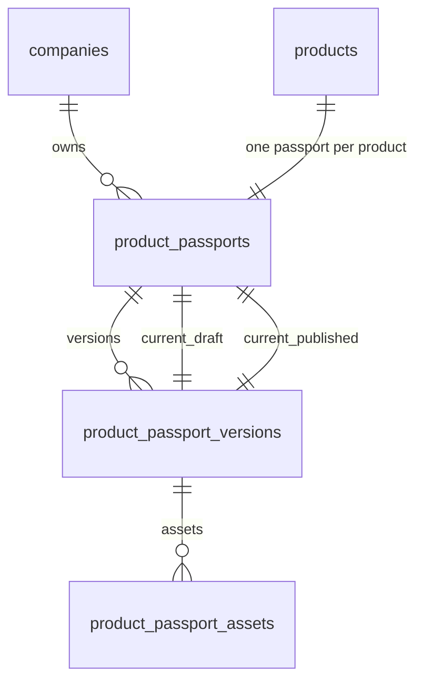

# NordiPass R2 — Passport Schema

**Stage:** R2.2
**Date:** 2026-07-16
**Status:** COMPLETE
**Dependencies:** R1 Core Catalog, R2.1 Architecture

---

## 1. Scope

This document defines the MySQL 8 schema for the R2 Product Passport module. It covers all tables, constraints, foreign keys, indexes, CHECK constraints, and triggers that make up the passport storage layer.

---

## 2. Tables

### 2.1 `product_passports`

The aggregate root for a Product Passport. One passport per Company+Product pair.

| Column | Type | Constraints |
|---|---|---|
| `id` | `BIGINT UNSIGNED` | `PRIMARY KEY AUTO_INCREMENT` |
| `uuid` | `CHAR(36)` | `UNIQUE NOT NULL` |
| `public_id` | `CHAR(36)` | `UNIQUE NOT NULL` (UUIDv7) |
| `company_id` | `BIGINT UNSIGNED` | `NOT NULL` |
| `product_id` | `BIGINT UNSIGNED` | `NOT NULL` |
| `status` | `VARCHAR(20)` | `NOT NULL CHECK(status IN ('draft','published','unpublished','archived'))` |
| `default_language` | `VARCHAR(5)` | `NOT NULL DEFAULT 'sv'` |
| `enabled_languages` | `JSON` | `NOT NULL` |
| `current_draft_version_id` | `BIGINT UNSIGNED` | `NULLABLE` |
| `current_published_version_id` | `BIGINT UNSIGNED` | `NULLABLE` |
| `first_published_at` | `TIMESTAMP` | `NULLABLE` |
| `last_published_at` | `TIMESTAMP` | `NULLABLE` |
| `unpublished_at` | `TIMESTAMP` | `NULLABLE` |
| `archived_at` | `TIMESTAMP` | `NULLABLE` |
| `created_by` | `BIGINT UNSIGNED` | `NOT NULL` |
| `updated_by` | `BIGINT UNSIGNED` | `NULLABLE` |
| `created_at` | `TIMESTAMP` | `NOT NULL DEFAULT CURRENT_TIMESTAMP` |
| `updated_at` | `TIMESTAMP` | `NOT NULL DEFAULT CURRENT_TIMESTAMP ON UPDATE CURRENT_TIMESTAMP` |

**Indexes:**
- `UNIQUE(company_id, product_id)` — product_passports_company_product_unique
- `INDEX(company_id, status)` — product_passports_company_status_index
- `INDEX(current_draft_version_id)` — product_passports_draft_version_fk_index
- `INDEX(current_published_version_id)` — product_passports_published_version_fk_index

**Foreign Keys:**
- `company_id → companies(id) ON DELETE RESTRICT`
- `product_id → products(id) ON DELETE RESTRICT`
- `created_by → users(id) ON DELETE RESTRICT`
- `updated_by → users(id) ON DELETE SET NULL`

**Composite FKs:**
- `(company_id, product_id) → products(company_id, id) ON DELETE RESTRICT`
- `(company_id, current_draft_version_id) → product_passport_versions(company_id, passport_id, id) ON DELETE RESTRICT`
- `(company_id, current_published_version_id) → product_passport_versions(company_id, passport_id, id) ON DELETE RESTRICT`

**Triggers:**
- `BEFORE UPDATE` — prevent modification of `uuid`, `public_id`, `company_id`, `product_id`

---

### 2.2 `product_passport_versions`

Immutable published/draft snapshots of a passport.

| Column | Type | Constraints |
|---|---|---|
| `id` | `BIGINT UNSIGNED` | `PRIMARY KEY AUTO_INCREMENT` |
| `uuid` | `CHAR(36)` | `UNIQUE NOT NULL` |
| `company_id` | `BIGINT UNSIGNED` | `NOT NULL` |
| `passport_id` | `BIGINT UNSIGNED` | `NOT NULL` |
| `version_number` | `INT UNSIGNED` | `NOT NULL, version_number > 0` |
| `status` | `VARCHAR(20)` | `NOT NULL CHECK(status IN ('draft','published','superseded','withdrawn'))` |
| `draft_revision` | `INT UNSIGNED` | `NOT NULL DEFAULT 0` |
| `payload` | `JSON` | `NOT NULL` |
| `schema_version` | `VARCHAR(20)` | `NOT NULL DEFAULT '1.0'` |
| `reason` | `VARCHAR(500)` | `NULLABLE` |
| `created_by` | `BIGINT UNSIGNED` | `NOT NULL` |
| `created_at` | `TIMESTAMP` | `NOT NULL DEFAULT CURRENT_TIMESTAMP` |
| `updated_at` | `TIMESTAMP` | `NOT NULL DEFAULT CURRENT_TIMESTAMP ON UPDATE CURRENT_TIMESTAMP` |

**Indexes:**
- `UNIQUE(company_id, passport_id, version_number)` — passport_versions_company_passport_version_unique
- `INDEX(company_id, passport_id, id)` — passport_versions_company_passport_id_index (for composite FK)
- `INDEX(company_id, passport_id, status)` — passport_versions_company_passport_status_index

**Foreign Keys:**
- `company_id → companies(id) ON DELETE RESTRICT`
- `(company_id, passport_id) → product_passports(company_id, id) ON DELETE RESTRICT`
- `created_by → users(id) ON DELETE RESTRICT`

**Triggers:**
- `BEFORE UPDATE` — prevent modification of non-draft versions (only draft versions can be updated)

---

### 2.3 `product_passport_assets`

Immutable file manifests for passport versions.

| Column | Type | Constraints |
|---|---|---|
| `id` | `BIGINT UNSIGNED` | `PRIMARY KEY AUTO_INCREMENT` |
| `uuid` | `CHAR(36)` | `UNIQUE NOT NULL` |
| `company_id` | `BIGINT UNSIGNED` | `NOT NULL` |
| `passport_id` | `BIGINT UNSIGNED` | `NOT NULL` |
| `version_id` | `BIGINT UNSIGNED` | `NOT NULL` |
| `kind` | `VARCHAR(30)` | `NOT NULL CHECK(kind IN ('product_media','variant_media','document'))` |
| `source_resource_uuid` | `CHAR(36)` | `NULLABLE` |
| `role` | `VARCHAR(50)` | `NULLABLE` |
| `sort_order` | `INT UNSIGNED` | `NOT NULL DEFAULT 0` |
| `language` | `VARCHAR(5)` | `NULLABLE` |
| `mime_type` | `VARCHAR(100)` | `NOT NULL` |
| `file_extension` | `VARCHAR(20)` | `NOT NULL` |
| `size_bytes` | `BIGINT UNSIGNED` | `NOT NULL` |
| `width` | `INT UNSIGNED` | `NULLABLE` |
| `height` | `INT UNSIGNED` | `NULLABLE` |
| `checksum_sha256` | `CHAR(64)` | `NOT NULL` |
| `storage_key` | `VARCHAR(500)` | `UNIQUE NOT NULL` |
| `is_public` | `TINYINT(1)` | `NOT NULL DEFAULT 1` |
| `created_at` | `TIMESTAMP` | `NOT NULL DEFAULT CURRENT_TIMESTAMP` |
| `updated_at` | `TIMESTAMP` | `NOT NULL DEFAULT CURRENT_TIMESTAMP ON UPDATE CURRENT_TIMESTAMP` |

**Indexes:**
- `UNIQUE(storage_key)`
- `INDEX(company_id, passport_id, version_id)` — passport_assets_company_passport_version_index

**Foreign Keys:**
- `company_id → companies(id) ON DELETE RESTRICT`
- `(company_id, passport_id) → product_passports(company_id, id) ON DELETE RESTRICT`
- `(company_id, passport_id, version_id) → product_passport_versions(company_id, passport_id, id) ON DELETE RESTRICT`

**Triggers:**
- `BEFORE UPDATE` — always reject (assets are immutable)
- `BEFORE DELETE` — always reject (controlled purge only)

---

## 3. Entity Relationships (Mermaid ER)

---

## 4. Immutability Guarantees

| Entity | Immutable Fields | Guard | Trigger |
|---|---|---|---|
| `product_passports` | `uuid`, `public_id`, `company_id`, `product_id` | Model `booted()` | `BEFORE UPDATE` |
| `product_passport_versions` | All fields when status != draft | Model `booted()` | `BEFORE UPDATE` (draft-only) |
| `product_passport_assets` | All fields (always) | — | `BEFORE UPDATE`, `BEFORE DELETE` |

---

## 5. Tenant Isolation

All tables include `company_id` as the first column in composite unique keys and composite foreign keys:

- `UNIQUE(company_id, product_id)` on product_passports
- `UNIQUE(company_id, passport_id, version_number)` on product_passport_versions
- `(company_id, passport_id)` FK → product_passports
- `(company_id, passport_id, version_id)` FK → product_passport_versions

This prevents cross-tenant pointer manipulation at the database level.

---

## 6. Migration Inventory

| # | Migration | Purpose |
|---|---|---|
| 1 | `create_product_passports_table` | Passport aggregate root |
| 2 | `create_product_passport_versions_table` | Immutable version store |
| 3 | `add_passport_version_pointers` | current_draft_version_id, current_published_version_id |
| 4 | `create_product_passport_assets_table` | File manifest |
| 5 | `add_passport_deferred_foreign_keys` | Composite FKs and CHECKs |
| 6 | `add_passport_immutability_triggers` | MySQL triggers |

---

## 7. Rollback and Re-migrate

All migrations support `down()` for safe rollback:
- `down()` drops triggers first, then constraints, then tables
- No data loss in R1 tables during rollback
- Re-migration restores all schema guarantees

---

## 8. Tests

Schema tests verify:
- Table and column existence
- CHECK constraints
- Composite foreign keys with tenant prefix
- Trigger immutability enforcement
- Migration rollback and re-migration
- Version numbering constraints

---

## 9. References

- **R2.4 DPP Data Model:** [R2_DPP_DATA_MODEL.md](R2_DPP_DATA_MODEL.md) — The schema defined here is consumed by the R2.4 authoring layer, which validates and normalizes DPP payloads stored in `product_passport_versions.payload`.
- **R2.5 — DPP Readiness:** [R2_DPP_READINESS.md](R2_DPP_READINESS.md)
