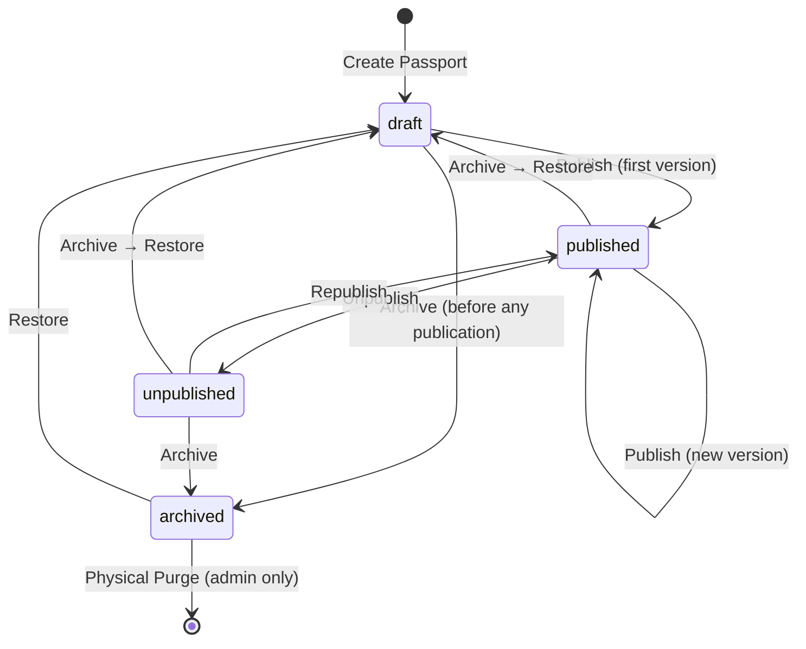
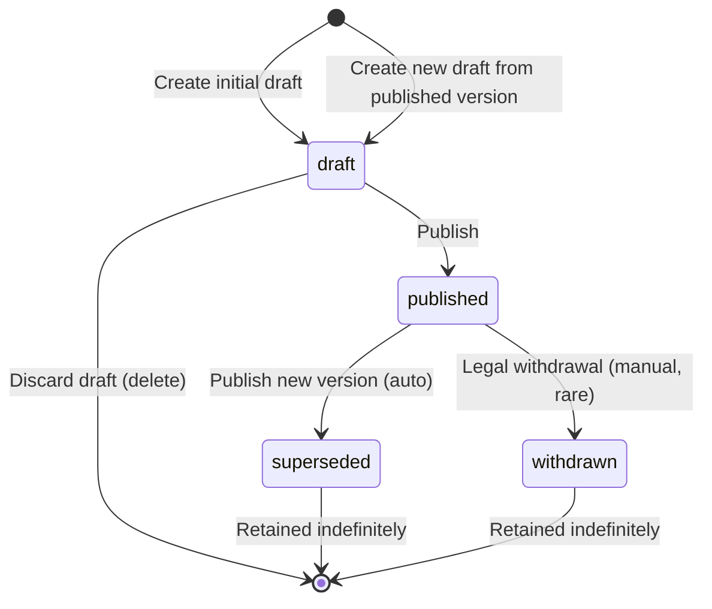

# NordiPass R2 — Publication Domain

**Stage:** R2.1
**Date:** 2026-07-16
**Status:** COMPLETE
**Scope:** Product Passport Publication Domain Architecture

---

This document is the authoritative technical specification for the R2 Product Passport Publication Domain. It defines the ubiquitous language, bounded contexts, aggregate model, lifecycles, snapshot contract, catalog integration, public identity, security, operations, and R2.2 schema handoff.

---

## 1. Ubiquitous Language

The following terms have precise meanings within the Publication Domain. Using them interchangeably is forbidden.

| Term | Definition |
|---|---|
| **Catalog Product** | A Product managed in R1 Catalog. The source of identity, variants, attributes, categories, and media for passports. |
| **Product Passport (Passport)** | The publication aggregate. A digital document representing a Product for external consumers. Owned by a Company. Has exactly one current public identity. |
| **Passport Draft** | The mutable working copy of a passport. Content can be edited freely. Not publicly visible. Maximum one draft per Passport. |
| **Passport Version** | An immutable published snapshot of a passport at a point in time. Has a version number. Cannot be modified after publication. |
| **Published Version** | A Passport Version with status `published`. It is the current public-facing version if the Passport is in `published` status. |
| **Current Published Version** | The version pointed to by the Passport's `current_version_id`. This is what the stable public URL resolves to. |
| **Superseded Version** | A previously published version that has been replaced by a newer version. Preserved in history. Not publicly accessible by default. |
| **Withdrawn Version** | A published version that was removed for legal/regulatory reasons. Not publicly accessible. Rarely used. |
| **Publication** | The act of creating an immutable Passport Version from a draft and making it the current published version. |
| **Snapshot** | The complete immutable JSON payload of a published Passport Version. Contains all product data, DPP sections, translations, media references, and document references. |
| **Snapshot Schema** | The versioned JSON schema that defines the structure of the snapshot payload. Allows evolution of DPP content without breaking existing versions. |
| **Public Identifier (public_id)** | A globally unique, opaque identifier for a Passport. Used in public URLs and QR codes. Stable across all versions. |
| **Public URL** | The stable URL that resolves to the current published version of a Passport: `/p/{public_id}`. |
| **Preview** | An authenticated, non-public rendering of a draft Passport. Shows what will be published. Not cached. |
| **Publish** | The transaction that creates an immutable version from a draft, assigns a version number, and sets it as the current published version. |
| **Republish** | Restoring the current published pointer to the most recent published version after an unpublish. Does NOT create a new version. |
| **Unpublish** | Removing the current published pointer. The public URL returns 410. All versions preserved. |
| **Archive** | Retiring a Passport. Removes public access. All data preserved. Can be restored to draft. |
| **Pinned Asset** | A media file or document version that is referenced by its checksum in a published snapshot. The pinned reference is immutable. |
| **Readiness** | The evaluation of whether a Passport draft contains all required content for publication. Returns blockers (must fix) and warnings (should fix). |
| **Blocker** | A condition that prevents publication. Must be resolved before the passport can be published. |
| **Warning** | A condition that should be addressed but does not prevent publication. Advisory only. |

---

## 2. Bounded Contexts

The Publication module is composed of several bounded contexts, each with clear ownership and boundaries.

### 2.1 Catalog (R1)

| Aspect | Detail |
|---|---|
| **Owner** | R1 Core Catalog |
| **Source of truth** | Product, ProductVariant, Category, AttributeDefinition, ProductMedia tables |
| **Inputs** | Company catalog management operations |
| **Outputs** | Product identity, variant identifiers, attributes, categories, media |
| **Allowed dependencies** | Company tenancy, permissions |
| **Forbidden dependencies** | Passport module (Catalog does not know about Passports) |

### 2.2 Passport Authoring (R2)

| Aspect | Detail |
|---|---|
| **Owner** | R2 Publication Domain |
| **Source of truth** | `product_passports` table, Passport Draft |
| **Inputs** | Catalog Product reference, user-filled DPP content, translations |
| **Outputs** | Passport Draft ready for publication |
| **Allowed dependencies** | Catalog (read-only), Company tenancy, permissions, audit |
| **Forbidden dependencies** | Public Delivery (drafts are internal) |

### 2.3 Publication (R2)

| Aspect | Detail |
|---|---|
| **Owner** | R2 Publication Domain |
| **Source of truth** | `product_passport_versions` table (published versions) |
| **Inputs** | Validated Passport Draft, pinned assets, translations |
| **Outputs** | Immutable Passport Version, current published pointer update |
| **Allowed dependencies** | Passport Authoring, Catalog (read-only for data sourcing), audit, domain events |
| **Forbidden dependencies** | Public Delivery (publication does not render pages) |

### 2.4 Documents (R2.3)

| Aspect | Detail |
|---|---|
| **Owner** | R2 Document Management module |
| **Source of truth** | `documents` and `document_versions` tables |
| **Inputs** | Company-uploaded documents |
| **Outputs** | Pinned document version references for passport snapshot |
| **Allowed dependencies** | Company tenancy, permissions, file storage |
| **Forbidden dependencies** | Public Delivery (documents served through passport context) |

### 2.5 Public Delivery (R2.7)

| Aspect | Detail |
|---|---|
| **Owner** | R2 Publication Domain |
| **Source of truth** | Published Passport Version snapshot |
| **Inputs** | Public URL request, language preference |
| **Outputs** | Rendered HTML page, media files, document downloads |
| **Allowed dependencies** | Publication (read-only), Company public branding (read-only) |
| **Forbidden dependencies** | Catalog (never queries live catalog tables), Passport Authoring (never reads drafts) |

### 2.6 QR (R2.8)

| Aspect | Detail |
|---|---|
| **Owner** | R2 Publication Domain |
| **Source of truth** | Passport public_id |
| **Inputs** | Stable Passport URL |
| **Outputs** | QR code image (PNG/SVG) |
| **Allowed dependencies** | Publication (read-only) |
| **Forbidden dependencies** | Version-specific data (QR encodes stable URL only) |

### 2.7 Analytics (R2.11)

| Aspect | Detail |
|---|---|
| **Owner** | R2 Analytics module |
| **Source of truth** | Analytics counters/logs |
| **Inputs** | Public page views, document downloads |
| **Outputs** | Anonymous aggregated statistics |
| **Allowed dependencies** | Public Delivery (logs view events) |
| **Forbidden dependencies** | Personal data, tracking cookies |

### 2.8 Company Branding (R2.10)

| Aspect | Detail |
|---|---|
| **Owner** | R2 Publication Domain |
| **Source of truth** | Company public profile (snapshot at publication time) |
| **Inputs** | Company name, logo, website, public contact |
| **Outputs** | Company branding data in snapshot |
| **Allowed dependencies** | Company model (read-only, at publication time) |
| **Forbidden dependencies** | Live Company mutable profile (published snapshots pin branding) |

---

## 3. Aggregate Model

### 3.1 ProductPassport Aggregate

The ProductPassport is the aggregate root for all passport operations.

```
ProductPassport Aggregate
├── ProductPassport (aggregate root)
│   ├── ProductPassportVersion (1 draft + N published/superseded)
│   │   ├── Snapshot (immutable JSON payload)
│   │   ├── Translation content (within snapshot)
│   │   ├── Pinned Media references (within snapshot)
│   │   └── Pinned Document references (within snapshot)
│   └── Publication pointer (current_version_id)
```

#### Identity

| Property | Type | Description |
|---|---|---|
| `id` | unsigned bigint | Internal primary key (not exposed) |
| `uuid` | UUID | Internal model UUID (HasUuid, R1 convention) |
| `public_id` | UUIDv7 | Globally unique opaque public identifier. Stable across all versions. Used in public URLs. |
| `company_id` | unsigned bigint | FK → companies. Tenant ownership. |
| `product_id` | unsigned bigint | FK → products. The Catalog Product this passport represents. |

#### Ownership

- Passport belongs to exactly one Company.
- Passport references exactly one Product.
- Product must belong to the same Company.
- Enforced via composite foreign keys: `UNIQUE(company_id, product_id)` and FK `(company_id, product_id) → products(company_id, id)`.

#### Mutability

| Field | Mutability |
|---|---|
| `public_id` | Immutable (set at creation) |
| `company_id` | Immutable |
| `product_id` | Immutable |
| `status` | Mutable through defined lifecycles transitions |
| `current_version_id` | Mutable through publish/unpublish/republish |
| `created_by` | Immutable |
| `updated_at` | Auto |
| `deleted_at` | Soft delete (administrative only) |

#### Invariants

1. One Passport per Company+Product pair.
2. Passport Company == Product Company.
3. `public_id` is globally unique.
4. Zero or one active draft version.
5. Zero or one current published version.
6. `current_version_id` (when set) references a version of the same Passport with status `published`.
7. Draft version (when exists) belongs to the same Passport.
8. Archived Passport has no draft and no current published pointer.

### 3.2 ProductPassportVersion Entity

| Property | Type | Description |
|---|---|---|
| `id` | unsigned bigint | Internal primary key |
| `uuid` | UUID | Internal model UUID |
| `passport_id` | unsigned bigint | FK → product_passports |
| `company_id` | unsigned bigint | FK → companies (denormalized from Passport) |
| `version_number` | unsigned int | Monotonic integer within Passport. Assigned at publication. |
| `status` | enum | `draft`, `published`, `superseded`, `withdrawn` |
| `snapshot_payload` | json | The complete immutable passport content (canonical JSON) |
| `snapshot_checksum` | char(64) | SHA-256 of canonical snapshot JSON |
| `schema_version` | varchar(20) | Snapshot schema version (e.g., "1.0") |
| `draft_revision` | unsigned int | The content revision counter at the time of publication (for duplicate detection) |
| `published_at` | timestamp | When this version was published (null for draft) |
| `published_by` | unsigned bigint | FK → users. The actor who published (null for draft) |
| `created_at` | timestamp | Auto |
| `updated_at` | timestamp | Auto (only for draft versions) |

#### Version Invariants

1. Version belongs to exactly one Passport.
2. Version Company == Passport Company.
3. Version number unique within Passport: `UNIQUE(passport_id, version_number)`.
4. Draft version: mutable, `published_at` NULL, `published_by` NULL.
5. Published/superseded/withdrawn versions: immutable (no UPDATE allowed after status leaves `draft`).
6. Exactly one version can have status `draft` per Passport.
7. Exactly one version can have status `published` per Passport.
8. `snapshot_checksum` required for non-draft versions.
9. `published_at` and `published_by` set simultaneously at publication.
10. Version number assigned within the publication transaction (no gaps).
11. Version status transitions: `draft → published → superseded` (or `draft → published → withdrawn`).

### 3.3 Published Snapshot (Value Object within Version)

The snapshot is the immutable JSON payload stored in `snapshot_payload`. It is a value object — no identity of its own; it is the content of a Version.

**Schema version:** `"1.0"`

**Canonical serialization:** JSON with sorted keys, no insignificant whitespace, UTF-8.

**Checksum algorithm:** SHA-256 of canonical JSON bytes.

**Maximum payload size:** 1 MB (enforced at application level).

**Logical sections (see §6 Snapshot Contract for full definition):**
- `schema_version`
- `passport_public_id`
- `version_number`
- `published_at`
- `default_language`
- `available_languages`
- `product` — identity, descriptions, categories
- `variants` — identifiers, attributes, is_default
- `attributes` — product-level attributes
- `dpp_sections` — manufacturer, safety, usage, repair, recycling
- `documents` — pinned document references
- `media` — pinned media references
- `company` — public company profile snapshot
- `publication_metadata` — published_by, checksum

### 3.4 Translation Content (Embedded in Snapshot)

Translations are not stored in a separate table. They are embedded in the snapshot JSON under each translatable section.

Structure:
```json
{
  "section_name": {
    "sv": "Swedish content",
    "en": "English content"
  }
}
```

The `available_languages` array lists all languages with complete translations in this version.

### 3.5 Pinned Asset References (Embedded in Snapshot)

Media and document references in the snapshot include checksums, making the reference immutable and verifiable.

See §8 (Media Pinning) and §9 (Document Pinning) for the full contract.

### 3.6 Publication Pointer

The Passport's `current_version_id` is a pointer to the currently published version. It is:
- Set on initial publication.
- Updated on each new publication.
- Set to NULL on unpublish.
- Restored on republish.
- Set to NULL on archive.

The pointer is always consistent: it references a version with `status = published` belonging to the same Passport.

---

## 4. Product Passport Invariants (Complete)

| # | Invariant | Enforcement |
|---|---|---|
| 1 | Passport belongs to one Company | `company_id` FK → companies |
| 2 | Passport relates to one Product | `product_id` FK → products |
| 3 | Product belongs to same Company | Composite FK `(company_id, product_id) → products(company_id, id)` |
| 4 | One Passport per Company+Product | `UNIQUE(company_id, product_id)` |
| 5 | Zero or one active draft version | Application-level: unique `WHERE status = 'draft'` check |
| 6 | Zero or one current published version | Application-level: the `current_version_id` pointer |
| 7 | `public_id` globally unique | `UNIQUE(public_id)` |
| 8 | Archived Passport has no public access | Application-level: status check |
| 9 | Published version immutable | Application-level: no UPDATE after status leaves draft |
| 10 | `current_version_id` references version of same Passport | Application-level + FK referencing versions table |
| 11 | Version Company == Passport Company | Application-level: set from Passport |
| 12 | Version number unique within Passport | `UNIQUE(passport_id, version_number)` |

---

## 5. Passport Lifecycle

### 5.1 Passport Aggregate Statuses

| Status | Description | Public URL | Draft Exists |
|---|---|---|---|
| `draft` | Passport created, being prepared. Not published yet. | 404 | Yes (exactly one) |
| `published` | At least one version published. Publicly accessible. | 200 (current version) | Yes (optional) |
| `unpublished` | Was published, now hidden. Versions preserved. | 410 Gone | Yes (optional) |
| `archived` | Passport retired. All data preserved. | 410 Gone | No |

### 5.2 State Diagram



### 5.3 Allowed Transitions

| From | To | Operation | Preconditions | Authorization | Transaction | Audit Event | Public Effect |
|---|---|---|---|---|---|---|---|
| (none) | `draft` | Create Passport | Product exists and belongs to Company; no other Passport for this Product | `passport.create` | Yes (INSERT Passport + draft version) | `passport.created` | None (draft is internal) |
| `draft` | `published` | Publish (first) | Passport readiness passed; Product active; validation passed; draft exists | `passport.publish` | Yes (INSERT version + UPDATE Passport) | `passport.version.published` | Public URL becomes active (200) |
| `published` | `published` | Publish (new version) | Draft exists; readiness passed; previous version superseded | `passport.publish` | Yes | `passport.version.published` | Public URL now serves new version |
| `published` | `unpublished` | Unpublish | Passport is `published` | `passport.unpublish` | Yes (UPDATE pointer to NULL) | `passport.unpublished` | Public URL returns 410 |
| `unpublished` | `published` | Republish | Passport was `unpublished`; has a published version | `passport.publish` | Yes (UPDATE pointer) | `passport.republished` | Public URL active again |
| `draft` | `archived` | Archive (draft only) | Passport in `draft`; no published versions | `passport.archive` | Yes (discard draft + archive) | `passport.archived` | None (was already internal) |
| `published` | `archived` | Archive | Passport is `published` | `passport.archive` | Yes (UPDATE status) | `passport.archived` | Public URL returns 410 |
| `unpublished` | `archived` | Archive | Passport is `unpublished` | `passport.archive` | Yes (UPDATE status) | `passport.archived` | Public URL returns 410 |
| `archived` | `draft` | Restore | Passport is `archived` | `passport.restore` | Yes (UPDATE status) | `passport.restored` | Public URL still 410 (draft) |

### 5.4 Forbidden Transitions

| From | To | Reason |
|---|---|---|
| `published` | `draft` | Cannot downgrade a published passport to draft. Unpublish first, or create a new draft. |
| `draft` | `unpublished` | Meaningless — draft has no public URL. Archive instead. |
| `archived` | `published` | Must go through restore (to draft) → publish. |
| `archived` | `unpublished` | Must go through restore (to draft) first. |
| Any | Physical deletion | Not available in UI. Administrative CLI only. |

---

## 6. Passport Version Lifecycle

### 6.1 Version Statuses

| Status | Description | Mutable | Publicly Accessible |
|---|---|---|---|
| `draft` | Content being prepared. Single draft per Passport. | Yes | No |
| `published` | Immutable published version. The "current" version if Passport is published. | No | Yes (via current pointer) |
| `superseded` | Replaced by a newer published version. Preserved in history. | No | No (default; configurable) |
| `withdrawn` | Removed for legal/regulatory reasons. Rare. | No | No |

### 6.2 State Diagram



### 6.3 Version Transitions

| Transition | Trigger | Preconditions | Effect |
|---|---|---|---|
| Create initial draft | Create Passport | Passport in `draft` status | Version created with `version_number = null`, `status = draft` |
| Create new draft from published | User action | Passport `published`; no existing draft | Version created with `status = draft`; initial content copied from current published version |
| Update draft | User edits | Version `status = draft` | Content updated; `content_revision` incremented |
| Publish | User action | Draft exists; readiness passed; Product active; validation passed | Version number assigned; status → `published`; snapshot built and stored; `published_at` and `published_by` set |
| Supersede | Auto (on new publication) | New version published | Previous `published` version → `superseded` |
| Withdraw | Administrative action | Version `published` and regulatory need | Status → `withdrawn` |
| Discard draft | User action | Version `status = draft`; not the only version (if Passport published) | Version row deleted |

### 6.4 Version Numbering

Version numbers are assigned transactionally at publication:

1. Lock Passport row.
2. SELECT `MAX(version_number)` from versions WHERE `passport_id = ?`.
3. New version number = `COALESCE(MAX, 0) + 1`.
4. INSERT new version with assigned number.
5. Version numbers are never reused.

---

## 7. Passport → Product Data Sourcing Matrix

This table defines where each piece of passport data comes from, whether it can be overridden in the passport draft, and how it behaves in the published snapshot.

| Data Group | Catalog Source | Passport Editable Override | Translation | In Snapshot | Public | Required for Readiness |
|---|---|---|---|---|---|---|
| **Product name** | `products.name` | Yes (per language) | Yes | Yes | Yes | Hard blocker (default language) |
| **Slug** | `products.slug` | No | No | Yes | No (URL uses public_id) | No |
| **Short description** | `products.short_description` | Yes (per language) | Yes | Yes | Yes | Warning |
| **Long description** | `products.description` | Yes (per language) | Yes | Yes | Yes | Warning |
| **Brand** | `products.brand` | Yes (single value) | No | Yes | Yes | Warning |
| **Manufacturer** | `products.manufacturer` | Yes (single value) | No | Yes | Yes | Hard blocker |
| **Country of origin** | Not in R1 Catalog | Yes (single value) | No | Yes | Yes | Warning |
| **Primary Category** | `products.primary_category_id → categories` | No (read from Catalog) | No (category name per language future) | Yes | Yes | No (from Catalog) |
| **Secondary Categories** | `category_product` pivot | No | No | Yes | Yes | No |
| **Default Variant** | `products.default_variant_id → product_variants` | No | No (Variant data per language future) | Yes | Yes | No (from Catalog) |
| **All Variants** | `product_variants WHERE product_id` | No (but can choose which to include) | No | Yes | Yes | No (default Variant only for readiness) |
| **Variant SKU** | `product_variants.sku` | No (read from Catalog) | No | Yes | Yes | Warning |
| **Variant GTIN** | `product_variants.gtin` | No (read from Catalog) | No | Yes | Yes | Warning |
| **Variant MPN** | `product_variants.mpn` | No (read from Catalog) | No | Yes | Yes | No |
| **Variant name** | `product_variants.name` | No | No | Yes | Yes | No |
| **Product attributes** | `product_attribute_values` | No | No (attribute labels per language future) | Yes | Yes | Per R1 required check |
| **Variant attributes** | `variant_attribute_values` (default Variant) | No | No | Yes | Yes | Per R1 required check |
| **Product media** | `product_media` (where `variant_id IS NULL`) | Yes (select which to include) | Yes (alt_text per language) | Yes (pinned by checksum) | Yes | Warning (primary only) |
| **Variant media** | `product_media` (where `variant_id IS NOT NULL`) | Yes (select which to include) | Yes (alt_text per language) | Yes (pinned by checksum) | Yes | No |
| **Company name** | `companies.name` | No | No | Yes (snapshot at publication) | Yes | No |
| **Company logo** | Company branding (R2.10) | No | No | Yes (snapshot at publication) | Yes | No |
| **Company website** | Company branding (R2.10) | No | No | Yes (snapshot at publication) | Yes | No |
| **DPP: Manufacturer info** | Not in R1 | **Yes — Passport-specific** | Yes (per language) | Yes | Yes | Hard blocker (default language) |
| **DPP: Safety/compliance** | Not in R1 | **Yes — Passport-specific** | Yes (per language) | Yes | Yes | Hard blocker (default language) |
| **DPP: Usage instructions** | Not in R1 | **Yes — Passport-specific** | Yes (per language) | Yes | Yes | Warning |
| **DPP: Repair/maintenance** | Not in R1 | **Yes — Passport-specific** | Yes (per language) | Yes | Yes | Warning |
| **DPP: Recycling/disposal** | Not in R1 | **Yes — Passport-specific** | Yes (per language) | Yes | Yes | Hard blocker (default language) |
| **Documents** | Not in R1 | **Yes — Passport-specific** | Yes (per document language) | Yes (pinned by checksum) | Yes (if public) | Hard blocker (mandatory types) |
| **Public contact info** | Not in R1 | **Yes — Passport-specific** | Yes | Yes | Yes | No |

### Sourcing Behavior Types

| Behavior | Description |
|---|---|
| **Copied from Catalog** | At publication time, the current Catalog value is copied into the snapshot. No passport-level override. |
| **Referenced from Catalog while draft** | Draft reads live Catalog value for display. Publication copies it. |
| **Passport-specific override** | Passport has its own value, independent of Catalog. Can be pre-filled from Catalog but independently editable. |
| **Snapshot-only derived value** | Generated during publication (e.g., checksum, published_at). |
| **Not public** | Internal metadata only. Not included in public snapshot. |
| **Deferred** | Not implemented in R2. Placeholder for future stages. |

### Default Behavior: Copied from Catalog for identity fields; Passport-specific for DPP sections

Product identity fields (name, brand, manufacturer, identifiers) default to copying from Catalog at publication time. The Passport draft can override these values if the Company wants the passport to show different information than the internal catalog (e.g., a consumer-friendly product name vs. an internal SKU-based name).

DPP sections (safety, recycling, etc.) have no Catalog equivalent — they are purely Passport-specific content.

---

## 8. Media Pinning Contract — Copy-on-Publish

### 8.1 Architecture Decision

**Published passport media files are physically independent copies stored on a dedicated `passport_assets` storage disk. At publication time, every media file included in the passport is copied from Catalog storage to passport storage. The copy is the immutable published asset.**

This ensures:
- Published bytes are physically separate from mutable Catalog bytes.
- No Catalog operation (replacement, deletion, cleanup) can affect published passports.
- No changes to R1 media management are required.
- Clear bounded context boundary between Catalog and Publication.

### 8.2 Asset Storage

**Disk:** `passport_assets` (new filesystem disk, private, not web-accessible)

**Path pattern:**
```
{company_uuid}/passports/{passport_uuid}/versions/{version_number}/{media_uuid}.{ext}
```

### 8.3 Publication-Time Procedure

1. For each media item selected for the passport, read the source file from `catalog_media` disk.
2. Compute SHA-256 checksum of the source file.
3. Copy the file to the `passport_assets` disk at the determined path.
4. Verify SHA-256 of the copied file matches the source checksum.
5. Build pinned reference in the snapshot JSON.
6. Insert row in `product_passport_assets` table for operational tracking.

### 8.4 Asset Reference in Snapshot

At publication time, each media item included in the passport is pinned with its metadata:

```json
{
  "media_uuid": "01JN5QZ8K7X2W3Y4R5T6U7V8B",
  "filename": "product_front.jpg",
  "mime_type": "image/jpeg",
  "size_bytes": 102400,
  "width": 1200,
  "height": 800,
  "checksum_sha256": "e3b0c44298fc1c149afbf4c8996fb92427ae41e4649b934ca495991b7852b855",
  "alt_text": {
    "sv": "Produkt framifrån",
    "en": "Product front view"
  },
  "is_primary": true,
  "sort_order": 10
}
```

Note: `storage_path` is NOT in the public snapshot. It is stored in the `product_passport_assets` table for internal delivery use.

### 8.5 Public Media Delivery Contract

When serving a media file to a public consumer:

1. Read the pinned reference from the current published version's snapshot JSON.
2. Locate the file path from the `product_passport_assets` table.
3. Verify file existence on `passport_assets` disk.
4. Verify `sha256(file_content) === pinned_checksum`.
5. If valid: serve with:
   - `Content-Type: {mime_type}`
   - `Content-Length: {size_bytes}`
   - `ETag: "{checksum_sha256}"`
   - `Cache-Control: private, max-age=86400`
   - `X-Content-Type-Options: nosniff`
6. If checksum mismatch: log CRITICAL error, return 500 (published asset corrupted).
7. If file missing: log ERROR, return 410 (asset gone — should not happen for normal operations).

### 8.6 Media Immutability Guarantees

| Guarantee | Enforcement |
|---|---|
| Published bytes cannot be replaced | Physical copy on `passport_assets` disk; no write path for published assets |
| Catalog media deletion does not affect passport | Independent storage — `passport_assets` is separate disk from `catalog_media` |
| Catalog media cleanup does not affect passport | `catalog:media-cleanup` operates only on `catalog_media` disk |
| New Catalog media upload does not change historical versions | Copy was made at publication time; no back-reference |
| Published asset belongs to same Company | `company_uuid` in storage path verified against Passport Company |
| Physical purge is controlled | `passport:purge` CLI with explicit `--execute` flag; audit event logged |

### 8.7 Catalog Media Changes — Zero Impact on Published Passports

| Catalog Action | Effect on Existing Published Snapshot | Effect on New Publication |
|---|---|---|
| Replace media file | **No effect** — passport has independent copy | New publication copies new file |
| Delete media (soft) | **No effect** | Media not available for new publication |
| Hard delete media + file cleanup | **No effect** — `catalog:media-cleanup` operates on different disk | Media not available for new publication |
| Change alt text/metadata | **No effect** — snapshot has publication-time metadata | New publication copies new metadata |
| Set new primary | **No effect** | New publication uses new primary |
| Reorder | **No effect** | New publication uses new order |

### 8.8 Asset Retention

- Published passport media files are retained as long as the referencing version exists.
- When a passport version is administratively purged, its asset directory is deleted.
- `passport:asset-integrity-check` command verifies all referenced assets exist with correct checksums.
- R1 `catalog:media-cleanup` never touches `passport_assets` disk — no exclusion list needed.

---

## 9. Document Pinning Contract

### 9.1 Document Reference in Snapshot

```json
{
  "document_uuid": "01JN5QZ8K7X2W3Y4R5T6U7V8C",
  "document_version_uuid": "01JN5QZ8K7X2W3Y4R5T6U7V8D",
  "version_number": 2,
  "filename": "safety_data_sheet.pdf",
  "mime_type": "application/pdf",
  "size_bytes": 245760,
  "checksum_sha256": "a7ffc6f8bf1ed76651c14756a061d662f580ff4de43b49fa82d80a4b80f8434a",
  "language": "sv",
  "label": {
    "sv": "Säkerhetsdatablad",
    "en": "Safety Data Sheet"
  },
  "type": "certificate",
  "expiration_date": "2027-12-31",
  "is_public": true
}
```

### 9.2 Document Delivery Contract

1. Read pinned document reference from snapshot.
2. Locate document version file on private `documents` disk.
3. Verify checksum matches pinned reference.
4. Serve with:
   - `Content-Type: {mime_type}`
   - `Content-Disposition: inline; filename="{filename}"`
   - `Content-Length: {size_bytes}`
   - `ETag: "{checksum_sha256}"`
   - `Cache-Control: private, max-age=86400`
5. If document `is_public: false`: return 404 (not publicly accessible).
6. If checksum mismatch: log critical error, return 500.
7. If file missing: log error, return 410.

### 9.3 Document Expiration

Expiration date is stored in the snapshot. The public page shows the expiration date. Expired documents are still downloadable (the snapshot is immutable). The readiness check for a new draft warns about expired documents.

---

## 10. Translation Contract

### 10.1 Language Configuration

| Setting | Value |
|---|---|
| **Default language** | `sv` (Swedish) — configurable per Passport |
| **Enabled languages (pilot)** | `sv` (Swedish), `en` (English) |
| **Required languages** | `sv` (always required as default), `en` (required for pilot) |
| **Fallback chain** | Requested language → default language (`sv`) → first available |
| **Fallback behavior** | Section content falls back silently to default language |

### 10.2 Publication Readiness per Language

For the default language (`sv`) and each required language:
- All hard-blocker DPP sections must have content.
- Content must be non-empty (whitespace-only is empty).

A language is "ready" when all mandatory sections have non-empty content. Publication is blocked if any required language is not ready.

### 10.3 Snapshot Translation Structure

All translatable fields are stored as key-value maps in the JSON:

```json
{
  "product": {
    "name": {
      "sv": "Arbetshandske Pro",
      "en": "Work Glove Pro"
    },
    "short_description": {
      "sv": "Professionell arbetshandske i läder",
      "en": "Professional leather work glove"
    }
  },
  "dpp_sections": {
    "safety_compliance": {
      "sv": {
        "standards": "EN 388:2016",
        "ce_marking": "CE 2834"
      },
      "en": {
        "standards": "EN 388:2016",
        "ce_marking": "CE 2834"
      }
    }
  }
}
```

### 10.4 Public Language Resolution

```
Resolution order:
1. URL query parameter:         /p/{public_id}?lang=en
2. Path-based (future):         /p/{public_id}/en
3. Accept-Language header:      parse, match most specific enabled language
4. Cookie (future):             user language preference cookie
5. Default:                     Passport default language (sv)
```

Browser language detection (`navigator.language`) is NOT used as the sole determinant. It may inform a language selector UI but never automatically switches the page without user intent.

### 10.5 Language Selector

The public page includes a visible language selector showing all `available_languages` from the snapshot. The current language is highlighted. Switching languages reloads the page with the `?lang=` parameter.

### 10.6 Missing Translation Behavior

If the user selects `en` but a specific section has no English content:
- The section renders in the default language (`sv`).
- Visual indicator: "( text in Swedish )" or a subtle flag icon.
- No error message to the consumer.

---

## 11. Public Identity and URL Contract

### 11.1 Public Identifier

| Property | Value |
|---|---|
| **Format** | UUIDv7 (time-sortable UUID) |
| **Representation** | 36-character hex with hyphens (standard UUID format) in database and API. For public URLs: 32-character hex without hyphens for compactness. |
| **Uniqueness** | Globally unique via `UNIQUE(public_id)` |
| **Assignment** | Generated at Passport creation (not publication) |
| **Stability** | Immutable for the lifetime of the Passport |
| **Non-enumerability** | UUIDv7 is not sequential or guessable |
| **Case sensitivity** | Lowercase hex in URLs; case-insensitive comparison |

### 11.2 Public URL Structure

| URL | Purpose | Access |
|---|---|---|
| `/p/{public_id}` | Stable Passport URL. Resolves to current published version. | Public |
| `/p/{public_id}?lang=sv` | Passport with explicit language | Public |
| `/p/{public_id}/versions/{n}` | Specific historical version (if enabled) | Public (if configured) |
| `/p/{public_id}/documents/{doc_uuid}` | Document download | Public |
| `/p/{public_id}/media/{media_uuid}` | Media file delivery | Public |
| `/passports/{passport_id}/preview` | Authenticated preview of draft | Authenticated |
| `/passports/{passport_id}/qr` | Download QR code image | Authenticated |

### 11.3 Slug Behavior

R2 MVP does NOT include a cosmetic slug in public URLs. The URL `/p/{public_id}` is sufficient for pilot. A cosmetic slug (e.g., `/p/{public_id}/work-glove-pro`) can be added as a non-functional suffix in R3 for SEO purposes. The slug would be:
- Optional (redirect to canonical URL if missing or incorrect).
- Never used as a security boundary.
- Never used for enumeration.

### 11.4 404 vs 410 Behavior

| Condition | HTTP Status | Message |
|---|---|---|
| `public_id` not found | 404 Not Found | "Passport not found" (generic, no tenant leakage) |
| Passport is `draft` (never published) | 404 Not Found | "Passport not found" |
| Passport is `unpublished` | 410 Gone | "This passport is no longer available" |
| Passport is `archived` | 410 Gone | "This passport is no longer available" |
| Historical version access disabled | 404 Not Found | (treat as non-existent) |
| Withdrawn version | 410 Gone | "This version has been withdrawn" |
| Cross-Company passport | 404 Not Found | "Passport not found" (never reveal existence) |

### 11.5 QR Code Stability

QR code encodes the stable Passport URL: `https://{domain}/p/{public_id}`.

- QR does NOT encode a version-specific URL.
- QR does NOT encode a language parameter.
- QR is generated once and remains valid for the lifetime of the Passport.
- New version publication does not require a new QR.
- Unpublish: QR resolves to 410.
- Republish: QR resolves to current version again.

---

## 12. Preview Contract

### 12.1 Authorization

Preview is available only to authenticated users with `passport.preview` permission. The user must be an active member of the Passport's Company.

### 12.2 Source

Preview renders the current draft version's content. If no draft exists but a published version exists, it can optionally render the published version (for comparison).

### 12.3 Preview URL

```
GET /passports/{passport_uuid}/preview
```

Internal UUID, not the public `public_id`.

### 12.4 Security Controls

| Control | Value |
|---|---|
| **Authorization** | `passport.preview` permission required |
| **Tenant isolation** | Company-scoped query |
| **Robots** | `X-Robots-Tag: noindex, nofollow` |
| **Cache** | `Cache-Control: no-store, no-cache, must-revalidate` |
| **Watermark** | "PREVIEW — NOT PUBLISHED" indicator on the page |
| **Document access** | Documents accessible in preview |
| **Analytics** | Preview views are NOT counted |

### 12.5 Preview Token

For sharing a preview with non-logged-in stakeholders (e.g., compliance reviewer without system account), a time-limited preview token can be generated. This is a "could have" for R2 and is deferred to R3 if needed during pilot.

---

## 13. Publication Workflow (Detailed Sequence)

### 13.1 Full Publication Sequence

```
PHASE 0 — PRE-TRANSACTION (Validation Only)
  0.1  Authorize user (passport.publish permission)
  0.2  Resolve Company (CurrentCompany)
  0.3  Load Passport (company-scoped)
  0.4  Validate Passport status allows publication
  0.5  Validate Product exists and belongs to same Company
  0.6  Validate Product is active
  0.7  Run Catalog Readiness check
        → If failed: return blockers, abort
  0.8  Run Passport Readiness check
        → If failed: return blockers, abort

PHASE 1 — TRANSACTION (Atomic)
  1.1  BEGIN TRANSACTION
  1.2  Lock Passport row (SELECT ... FOR UPDATE)
  1.3  Lock active Draft Version row (SELECT ... FOR UPDATE)
  1.4  Re-validate Passport status (double-check under lock)
  1.5  Re-validate Draft exists and is not already published
  1.6  Re-validate Product active + Catalog readiness (under lock)
  1.7  Re-validate Passport readiness
  1.8  Resolve pinned media (read current metadata + checksums)
  1.9  Resolve pinned documents (read current document versions + checksums)
  1.10 Resolve translations for all required languages
  1.11 Build canonical JSON snapshot
  1.12 Validate snapshot schema (matches schema_version)
  1.13 Calculate snapshot SHA-256 checksum
  1.14 Determine next version number (MAX + 1 under lock)
  1.15 UPDATE draft version:
        - status = 'published'
        - version_number = {next}
        - snapshot_payload = {json}
        - snapshot_checksum = {checksum}
        - published_at = NOW()
        - published_by = {actor}
  1.16 If Passport has a current published version:
        UPDATE previous current version → status = 'superseded'
  1.17 UPDATE Passport:
        - current_version_id = {new version id}
        - status = 'published' (if was 'draft')
  1.18 INSERT audit event (passport.version.published)
  1.19 COMMIT

PHASE 2 — AFTER COMMIT (Async / Dispatched)
  2.1  Dispatch ProductPassportPublished domain event
  2.2  Invalidate public page cache for this public_id
  2.3  Warm public page cache (low priority)
  2.4  Generate QR code image (if first publication)
  2.5  Initialize analytics counters
```

### 13.2 Transaction Phase Assignment

| Step | Phase | Lock |
|---|---|---|
| Authorization | Pre-transaction | None |
| Catalog readiness | Pre-transaction | None |
| Passport readiness | Pre-transaction | None |
| Passport row lock | Transaction | `FOR UPDATE` on passport row |
| Draft version lock | Transaction | `FOR UPDATE` on draft version row |
| Snapshot build | Transaction | Held (read-only data) |
| Version persist | Transaction | Held |
| Pointer update | Transaction | Held |
| Audit persist | Transaction | Held |
| Commit | Transaction end | Released |
| Cache invalidation | After-commit | None |
| QR generation | After-commit | None |

### 13.3 Lock Order

To prevent deadlocks:

1. Lock Passport row first.
2. Lock Draft Version row second.
3. Lock previous Published Version row third (if exists, for superseding).
4. No other locks needed (Product is read-only, not locked by publication).

---

## 14. Concurrency Contract

### 14.1 Scenarios and Protection

| Scenario | Protection | Expected Result |
|---|---|---|
| Two publish requests simultaneously | Row lock on Passport (first wins, second waits) | Second request: 409 Conflict ("Passport is locked by another operation") |
| Publish + draft update simultaneously | Row lock on Passport + Draft Version; draft update must also lock Passport | One operation waits for the other |
| Publish + unpublish simultaneously | Same Passport lock | Sequential — whichever acquires lock first |
| Publish + Product archive simultaneously | Product archive does not lock Passport; publish validates Product active under lock | Publish may fail if Product just archived |
| Publish + Media delete simultaneously | Media delete does not lock Passport; publish reads current media state under its own snapshot timing | Snapshot captures media as it was at publish time |
| Two publications of same draft | Draft revision check: `draft_revision` already published → 409 | Second request: 409 "Draft already published" |
| Retry after network timeout | If first request committed: draft revision check → 409. If first request rolled back: second attempt proceeds normally. | If committed: 409. If not: normal publication. |
| After-commit event retry | Events are idempotent (cache invalidation, QR generation). `dispatchAfterResponse` ensures at-least-once. | Duplicate cache invalidation or QR generation is harmless. |

### 14.2 Lock Strategy

- **Pessimistic locking:** `SELECT ... FOR UPDATE` on Passport and Draft Version rows.
- **Optimistic locking:** Not used for publication (pessimistic is safer for critical path).
- **Deadlock prevention:** Consistent lock order across all passport operations (Passport → Version → previous Version).
- **Lock timeout:** Application-level timeout of 10 seconds. If lock cannot be acquired in 10 seconds, return 409.

### 14.3 Duplicate Publication Prevention

Primary defense: `content_revision` check on the draft version.

```
Before publication:
1. Read draft.content_revision
2. Check if any published version has this draft_revision
3. If yes → 409 Conflict
4. If no → proceed

During publication (in transaction):
5. Re-read draft.content_revision under lock
6. Re-check no published version has this draft_revision
7. Store draft_revision in the new published version
```

---

## 15. Idempotency Behavior

### 15.1 Without Idempotency-Key (R2 Pilot)

| Scenario | Behavior |
|---|---|
| Double submit (UI button double-click) | First request: publishes (200). Second request: draft already published → 409 Conflict. |
| Client timeout + retry | If first request committed: 409. If first request still in progress (lock held): second request waits on lock → eventual 409 or 200. |
| Queue event replay | Cache invalidation and QR generation are idempotent operations. |
| Duplicate cache invalidation | No-op on already-invalidated cache key. |

### 15.2 Draft Revision Check

The `content_revision` counter on the draft version provides idempotency at the domain level:

1. Each draft update increments `content_revision`.
2. Publication stores `draft_revision` in the published version.
3. Re-publishing the same draft revision is rejected.
4. A new draft (from current published) starts with a fresh `content_revision = 0`.

---

## 16. Catalog Lifecycle Interaction

### 16.1 Rules Table

| Catalog Event | Passport Behavior |
|---|---|
| Product created (draft) | Passport can be created immediately. Drafts can be edited. Publication blocked until Product active. |
| Product activated | Publication now possible (if readiness passed). Already published passports unaffected. |
| Product returned to draft | Published passports remain available. New publication blocked. Draft can be edited but not published. |
| Product archived | Published passports remain available (immutable snapshot independent). New publication blocked. Passport can be archived independently. |
| Product hard-deleted | Published passports remain but product identity in snapshot may reference non-existent product. Prevented by FK (product_id cannot be deleted while passport references it). |
| Variant added | New Variant available for next passport draft. Published passports unaffected. |
| Variant archived | Published passports unaffected. New draft excludes archived variants (or includes with "discontinued" flag). |
| Variant hard-deleted | Same as Product hard-delete: FK prevents deletion while referenced. |
| Default Variant changed | Published passports unaffected. New draft uses new default. |
| Variant SKU/GTIN changed | Published passports unaffected (snapshot has old values). New draft picks up new values. |
| Category reassigned | Published passports unaffected. New draft uses new category assignment. |
| Attribute value changed | Published passports unaffected. New draft picks up new values. |
| Media replaced | Published passports unaffected (pinned by old checksum). New draft picks up new media. |
| Media deleted | Published passports unaffected (pinned reference still valid). File retention enforced. |

### 16.2 Key Principle

**Catalog changes never silently modify a published passport.** The snapshot is immutable. All Catalog changes are visible only in the next published version.

---

## 17. Passport Readiness Boundary

### 17.1 Three-Layer Model

```
Layer 1: Catalog Readiness (R1 ProductActivationReadinessService)
    ↓ "Product is ready for publication"
Layer 2: Passport Readiness (R2 PassportReadinessService)
    ↓ "Passport content is complete"
Layer 3: Publication Validation (in Publish Action transaction)
    ↓ "Snapshot can be created"
    ↓
Publication
```

### 17.2 Layer 1: Catalog Readiness

Delegates to R1 `ProductActivationReadinessService::evaluate(company, product)`.

Returns blockers and warnings from R1's 10-gate checklist. Publication requires zero hard blockers.

### 17.3 Layer 2: Passport Readiness

New R2 `PassportReadinessService::evaluate(passport)`.

| Blocker Code | Condition |
|---|---|
| `product_not_active` | Product status is not `active` |
| `product_not_catalog_ready` | Product fails Catalog readiness (hard blockers) |
| `missing_manufacturer_info` | Manufacturer DPP section empty in default language |
| `missing_safety_info` | Safety/compliance DPP section empty in default language |
| `missing_recycling_info` | Recycling/disposal DPP section empty in default language |
| `missing_default_language_content` | Any hard-blocker section empty in default language |
| `missing_required_language_content` | Any hard-blocker section empty in a required language (`en`) |
| `missing_mandatory_documents` | Required document types not attached |
| `expired_mandatory_documents` | Mandatory document has expired |
| `missing_public_media` | No media selected for public display (warning in pilot, may become blocker) |

| Warning Code | Condition |
|---|---|
| `optional_sections_empty` | Non-blocker DPP sections empty |
| `missing_recommended_documents` | Recommended document types not attached |
| `document_expiring_soon` | Document expires within 30 days |
| `missing_product_description` | Product description empty |
| `missing_brand` | Brand field empty |
| `missing_primary_media` | No primary product media |
| `missing_variant_sku` | Default Variant has no SKU |
| `missing_variant_gtin` | Default Variant has no GTIN |
| `missing_company_logo` | Company public profile has no logo |

### 17.4 Layer 3: Publication Validation

Runs inside the publication transaction. Validates:

- Draft version exists and is not already published.
- All pinned assets exist on disk and have valid checksums.
- Snapshot JSON is valid and within 1MB limit.
- Snapshot schema version is compatible with current handler.
- No version number collision (under lock, this is guaranteed).
- Concurrent publication not in progress (lock held).

Failure at this layer rolls back the entire transaction.

---

## 18. Authorization and Permissions

### 18.1 Future Passport Permissions

These permissions will be added to the `CompanyPermission` enum in R2.2. They are NOT added to code in R2.1.

```php
case PassportView = 'passport.view';
case PassportCreate = 'passport.create';
case PassportUpdate = 'passport.update';
case PassportPreview = 'passport.preview';
case PassportPublish = 'passport.publish';
case PassportUnpublish = 'passport.unpublish';
case PassportArchive = 'passport.archive';
case PassportRestore = 'passport.restore';
case PassportVersionsView = 'passport.versions.view';
```

### 18.2 Permission Matrix

| Operation | Owner | Admin | Editor | Viewer |
|---|---|---|---|---|
| `passport.view` | Yes | Yes | Yes | Yes |
| `passport.create` | Yes | Yes | Yes | No |
| `passport.update` | Yes | Yes | Yes | No |
| `passport.preview` | Yes | Yes | Yes | Yes (own Company only) |
| `passport.publish` | Yes | Yes | No | No |
| `passport.unpublish` | Yes | Yes | No | No |
| `passport.archive` | Yes | Yes | No | No |
| `passport.restore` | Yes | Yes | No | No |
| `passport.versions.view` | Yes | Yes | Yes | Yes |

### 18.3 Authorization Flow

Same pattern as R1:

```
Route middleware → Controller → $user->can('passport.publish', $passport)
  → PassportPolicy::publish()
    → CompanyAuthorizer::allows(user, company, PassportPublish)
      → CompanyPermissionMatrix::allows(role, permission)
```

API dual authorization: token ability + membership permission both required.

---

## 19. Tenant Isolation

### 19.1 Invariants

| # | Invariant | Enforcement |
|---|---|---|
| 1 | Passport Company == Product Company | FK + application check |
| 2 | Version Company == Passport Company | Application-level (set from Passport) |
| 3 | Document Company == Passport Company | FK + application check |
| 4 | Pinned Media Company == Passport Company | Media belongs to Product which belongs to Company |
| 5 | Company A cannot view Passport B | Company-scoped queries (404 concealment) |
| 6 | Company A cannot preview Passport B | Authorization + 404 concealment |
| 7 | Company A cannot publish Passport B | Authorization + 404 concealment |
| 8 | Company A cannot pin Company B media | Catalog FK prevents cross-company media access |
| 9 | Company A cannot pin Company B documents | Document FK prevents cross-company access |
| 10 | Public resolver does not reveal Company existence | Generic 404 for all unknown public_ids |

### 19.2 Cross-Tenant Concealment

Same principle as R1: wrong-tenant internal resources return 404 (never 403). Generic 404 for all unknown public_ids (never reveal whether a passport exists behind the scenes).

---

## 20. Audit Taxonomy

### 20.1 Passport Audit Events

All passport events follow the naming pattern `passport.<resource>.<action>`:

| Event | Trigger | Safe Metadata |
|---|---|---|
| `passport.created` | Passport created | passport_uuid, public_id, product_uuid |
| `passport.draft.updated` | Draft content modified | passport_uuid, version_uuid, changed_sections |
| `passport.draft.discarded` | Draft deleted | passport_uuid, version_uuid |
| `passport.preview.generated` | Preview viewed (optional — may not audit) | passport_uuid, version_uuid |
| `passport.version.published` | Version published | passport_uuid, version_uuid, version_number, previous_version_number, product_uuid |
| `passport.version.superseded` | Previous version auto-superseded | passport_uuid, version_uuid, version_number, superseded_by_version |
| `passport.unpublished` | Passport unpublished | passport_uuid, was_current_version |
| `passport.republished` | Passport republished | passport_uuid, restored_version |
| `passport.archived` | Passport archived | passport_uuid, previous_status |
| `passport.restored` | Passport restored from archive | passport_uuid |

### 20.2 Audit Constraints

- Never store: full snapshot contents, full request body, document binaries, file contents, storage paths, preview tokens, checksums.
- Actor identified by UUID and email only.
- All events are Company-scoped via `logTenant()`.
- Events share the transaction with the operation they record.
- Failed transactions leave no audit records.

### 20.3 Preview Auditing

Preview generation may be audited at `info` level for operational visibility, but it is NOT a business audit event. Read-only preview does not require an immutable audit trail.

---

## 21. Domain Events and Queues

### 21.1 Domain Events (After-Commit)

| Event | Payload | Consumers |
|---|---|---|
| `ProductPassportCreated` | passport_uuid, public_id, company_uuid, product_uuid | Analytics init, search index (future) |
| `ProductPassportPublished` | passport_uuid, public_id, version_uuid, version_number, company_uuid | Cache invalidation, QR generation, analytics init, notification (future) |
| `ProductPassportUnpublished` | passport_uuid, public_id, company_uuid | Cache invalidation |
| `ProductPassportArchived` | passport_uuid, public_id, company_uuid | Cache invalidation, document cleanup scheduling |

### 21.2 Dispatch Rules

- All domain events dispatched AFTER successful transaction commit (`dispatchAfterResponse` or queued listener).
- Event dispatch failure must NOT roll back the publication.
- Events are queued on the `passport` queue (low priority).
- Failed events are logged with operation ID for recovery.

### 21.3 Queue Boundary

- Publication transaction does NOT wait for queue completion.
- Queue failure does NOT unpublish a successfully published passport.
- Side effects (cache invalidation, QR) are eventually consistent.
- The public page will serve the new version as soon as the cache is invalidated.
- Cache invalidation uses a sync dispatcher within `dispatchAfterResponse` for low latency.
- QR generation is queued (can take 1-2 seconds).

---

## 22. Cache and Public Delivery Contract

### 22.1 Cache Key Design

```
passport:public:{public_id}:v{current_version_id}:{language}
passport:public:{public_id}:media:{media_uuid}
passport:public:{public_id}:document:{document_version_uuid}
```

### 22.2 Cache Invalidation Triggers

| Trigger | Keys Invalidated |
|---|---|
| Publish new version | All `passport:public:{public_id}:*` keys |
| Unpublish | All `passport:public:{public_id}:*` keys |
| Republish | All `passport:public:{public_id}:*` keys |
| Archive | All `passport:public:{public_id}:*` keys |

### 22.3 Cache Headers

| Resource | Cache-Control | ETag | Notes |
|---|---|---|---|
| Public page HTML | `public, max-age=3600` | `{snapshot_checksum}` | Revalidated on new version |
| Media (images) | `private, max-age=86400` | `{pinned_checksum}` | Immutable — long TTL |
| Documents | `private, max-age=86400` | `{pinned_checksum}` | Immutable — long TTL |
| Preview | `no-store, no-cache, must-revalidate` | None | Never cached |

### 22.4 CDN Readiness

All public passport resources are cacheable at the CDN level:
- Public page: cache key includes version ID → new version naturally cache-busts.
- Media: checksum-based ETag → immutable content.
- Documents: checksum-based ETag → immutable content.
- Preview: `no-store` → never cached by CDN.

### 22.5 Stale Content Behavior

If cache invalidation fails after publication:
- The public page may show the previous version for up to 1 hour (TTL).
- The after-commit handler's cache invalidation should succeed within seconds.
- If invalidation completely fails: operational alert logged; manual cache clear available.

---

## 23. Public Security Contract

### 23.1 Security Controls

| Control | Implementation |
|---|---|
| **Opaque identifiers** | UUIDv7 public_id — not guessable or enumerable |
| **Rate limiting** | Public passport pages: 60 requests/minute per IP. Media/documents: 120/minute per IP. |
| **No internal IDs** | All snapshot content uses UUIDs or public identifiers only |
| **No storage paths** | Storage paths never exposed in public responses. Internal to delivery controller only. |
| **XSS prevention** | All DPP content rendered with Blade `{{ }}` escaping. No raw HTML in user content. |
| **Stored XSS prevention** | Content sanitized on save (strip tags, escape). |
| **Document MIME enforcement** | `Content-Type` strictly from pinned metadata. No sniffing. `X-Content-Type-Options: nosniff`. |
| **Content disposition** | Documents: `inline` for PDF, `attachment` for all others. Whitelist approach. |
| **CSP** | Content-Security-Policy header on public page. No inline scripts. |
| **Security headers** | `X-Frame-Options: DENY`, `X-Content-Type-Options: nosniff`, `Referrer-Policy: strict-origin-when-cross-origin` |
| **Noindex preview** | `X-Robots-Tag: noindex, nofollow` on preview pages |
| **Cache tenant separation** | Cache keys are per-public_id (globally unique → inherently tenant-isolated) |
| **Generic errors** | All public error responses are generic. No stack traces, no internal IDs, no tenant hints. |
| **Logging redaction** | SensitiveDataSanitizer extended for passport-specific fields (preview tokens, document paths). |
| **No tracking cookies** | Public passport page sets no cookies. No analytics cookies. No session cookies. |
| **HTTPS only** | Enforced at infrastructure level. HSTS header. |

### 23.2 Public Error Responses

```json
{
  "error": {
    "code": "passport_not_found",
    "message": "Passport not found"
  }
}
```

All public errors conform to the same generic format. No differentiation between "not found because doesn't exist" and "not found because wrong tenant."

---

## 24. Privacy Contract

### 24.1 Data Classification

| Classification | Data | Handling |
|---|---|---|
| **Public** | Product name, brand, manufacturer, DPP sections, variant identifiers, public documents | Included in public snapshot |
| **Public (restricted)** | Product media, document files | Authenticated via public URL; cached |
| **Internal metadata** | Version numbers, publication timestamps, audit events | Never exposed publicly |
| **Personal data** | Published_by (actor identifier) | Excluded from public snapshot; `published_by_uuid` in publication_metadata is NOT exposed publicly |
| **Operational logs** | Request IDs, IP addresses, timestamps | Retained per log retention policy; redacted before sharing |
| **Analytics data** | Page view counts, document download counts | Anonymous; no personal data; aggregated |

### 24.2 Public Snapshot Allowlist

The following are NEVER included in the public snapshot:
- `company_id` (numeric ID)
- `product_id` (numeric ID)
- `created_by`, `updated_by`, `published_by` (user email or ID)
- Internal storage paths
- Internal notes or comments
- Audit metadata
- Private document content (documents marked `is_public: false`)
- Employee contact information
- Company billing or administrative information
- Internal status comments

### 24.3 Company Public Profile

The Company data in the snapshot is an allowlisted subset:
- `name` — public
- `logo_url` — public (if set)
- `website` — public (if set)
- `public_contact_email` — public (if set)
- `public_phone` — public (if set)

All other Company fields (billing address, tax ID, internal contacts) are excluded.

---

## 25. Retention and Deletion

### 25.1 Default Retention

| Data | Retention |
|---|---|
| Published versions | Indefinite (until Company requests deletion or legal retention expires) |
| Superseded versions | Indefinite |
| Withdrawn versions | Indefinite |
| Draft versions | Until published or discarded. Discarded drafts: soft-deleted after 90 days. |
| Audit events | Per R0 audit retention (configurable, default 365 days) |
| Analytics data | 24 months rolling (anonymized) |
| Pinned media files | As long as the referencing version exists |
| Pinned document files | As long as the referencing version exists |

### 25.2 Deletion Scenarios

| Scenario | Action |
|---|---|
| User requests passport deletion | Not supported. Guide user to Archive instead. |
| Company requests data deletion (GDPR) | Administrative procedure. Run `passport:purge --company={uuid}` after verification. |
| Product hard-deleted | Passport preserved. Product UUID remains in snapshot. FK from passport to product must be SET NULL or RESTRICT. |
| Physical file cleanup | `passport:cleanup-orphan-assets` command. Dry-run by default. Explicit `--execute` required. |
| Version deletion | Not supported in UI. Administrative only. |

### 25.3 Physical Purge Command (Conceptual)

```
php artisan passport:purge
    --company={uuid}     (required)
    --passport={uuid}    (optional — single passport)
    --dry-run            (default — show what would be deleted)
    --execute            (actually delete)
    --older-than={days}  (only purge versions older than N days)
```

Only available via CLI. Not exposed in UI or API. Requires explicit confirmation.

---

## 26. Failure Scenarios

| Scenario | User-Visible Outcome | Database Outcome | Audit Outcome | Retry/Recovery |
|---|---|---|---|---|
| Product not active at publish | Error: "Product must be active" | Nothing written | No audit event | Fix product status, retry |
| Readiness blockers found | Error: list of blockers | Nothing written | No audit event | Fix blockers, retry |
| Draft already published | 409 Conflict: "Draft already published" | Nothing written | No audit event | Create new draft, retry |
| Concurrent publication (lock timeout) | 409 Conflict: "Passport is locked" | Nothing written | No audit event | Wait, retry |
| Asset missing at publish time | Error: "Asset {name} not found" | Transaction rolled back | No audit event | Upload/re-attach asset, retry |
| Asset checksum mismatch at publish | Error: "Asset {name} corrupted" | Transaction rolled back | No audit event | Re-upload asset, retry |
| Snapshot too large (> 1MB) | Error: "Snapshot exceeds size limit" | Transaction rolled back | No audit event | Reduce content, retry |
| Database constraint violation | 500 Internal Error (generic) | Transaction rolled back | No audit event | Logged for operations investigation |
| After-commit cache invalidation failure | Stale cache (up to 1 hour TTL) | Publication committed | Audit event persisted | Manual cache clear; operational alert |
| After-commit QR generation failure | No QR available in admin UI | Publication committed | Audit event persisted | Manual QR regeneration; operational alert |
| Public asset missing (on delivery) | 410 Gone (for that asset) | N/A | Operational log entry | Restore file from backup; operational alert |
| Public asset checksum mismatch (on delivery) | 500 for that asset | N/A | Critical operational log | Restore correct file; operational alert |
| Passport deleted while consumer viewing | 410 Gone on next page load | Passport archived, not deleted | Archival audit event | Consumer sees "no longer available" |
| Company suspended | Public access blocked (503 or 410) | Nothing changed | Nothing (infrastructure-level) | Restored when Company reactivated |

---

## 27. Operational Logging

### 27.1 Log Levels

| Level | Events |
|---|---|
| **INFO** | Publication success, version superseded, passport created, draft updated |
| **WARNING** | Readiness warnings, document expiring soon, cache invalidation retry |
| **ERROR** | Publication failure, asset integrity failure, snapshot validation failure |
| **CRITICAL** | Published asset checksum mismatch, cross-tenant data access detected, database corruption |

### 27.2 Structured Log Context

All passport operational logs include:
```json
{
  "operation": "passport.publish",
  "passport_uuid": "...",
  "public_id": "...",
  "version_number": 3,
  "company_uuid": "...",
  "actor_uuid": "...",
  "request_id": "...",
  "duration_ms": 234
}
```

### 27.3 Scheduler Tasks

| Task | Frequency | Description |
|---|---|---|
| `passport:check-document-expiry` | Daily 06:00 | Detect documents expiring within 30 days; create notifications |
| `passport:cleanup-orphan-assets --dry-run` | Weekly Sunday 04:00 | Detect pinned files no longer referenced; report only |
| `passport:prune-discarded-drafts` | Daily 03:00 | Hard-delete discarded drafts older than 90 days |

---

## 28. R2.2 Schema Handoff

This section provides the conceptual database schema blueprint for the next stage (R2.2). No migrations are written in R2.1.

### 28.1 Conceptual Tables

#### `product_passports`

| Column | Type | Constraints | Purpose |
|---|---|---|---|
| `id` | unsigned bigint | PK, auto-increment | Internal primary key |
| `uuid` | char(36) | UNIQUE, NOT NULL | Internal model UUID (R1 convention, HasUuid) |
| `public_id` | char(36) | UNIQUE, NOT NULL | Globally unique public identifier (UUIDv7) |
| `company_id` | unsigned bigint | FK → companies(id), NOT NULL | Tenant ownership |
| `product_id` | unsigned bigint | FK → products(id), NOT NULL | Catalog Product reference |
| `status` | varchar(20) | NOT NULL, CHECK (status IN ('draft','published','unpublished','archived')) | Passport lifecycle status |
| `current_version_id` | unsigned bigint | FK → product_passport_versions(id), NULLABLE | Pointer to current published version |
| `created_by` | unsigned bigint | FK → users(id), NOT NULL | Actor who created the passport |
| `created_at` | timestamp | NOT NULL | |
| `updated_at` | timestamp | NOT NULL | |
| `deleted_at` | timestamp | NULLABLE | Soft delete (administrative only) |

**Indexes:**
- `UNIQUE(company_id, product_id)` — one passport per Product per Company
- `INDEX(company_id, status)` — list passports by Company and status
- `INDEX(public_id)` — public URL resolution (already covered by UNIQUE)
- `INDEX(company_id, created_at)` — recent passports list

#### `product_passport_versions`

| Column | Type | Constraints | Purpose |
|---|---|---|---|
| `id` | unsigned bigint | PK, auto-increment | Internal primary key |
| `uuid` | char(36) | UNIQUE, NOT NULL | Internal model UUID |
| `passport_id` | unsigned bigint | FK → product_passports(id), NOT NULL | Parent Passport |
| `company_id` | unsigned bigint | FK → companies(id), NOT NULL | Denormalized tenant (from Passport) |
| `version_number` | unsigned int | NOT NULL (nullable for draft) | Monotonic version number |
| `status` | varchar(20) | NOT NULL, CHECK (status IN ('draft','published','superseded','withdrawn')) | Version lifecycle status |
| `snapshot_payload` | json | NULLABLE (NOT NULL when published) | Complete immutable passport content |
| `snapshot_checksum` | char(64) | NULLABLE (NOT NULL when published) | SHA-256 of canonical snapshot JSON |
| `schema_version` | varchar(20) | NOT NULL DEFAULT '1.0' | Snapshot schema version |
| `draft_revision` | unsigned int | NOT NULL DEFAULT 0 | Content revision counter (for duplicate detection) |
| `published_at` | timestamp | NULLABLE | When this version was published |
| `published_by` | unsigned bigint | FK → users(id), NULLABLE | Actor who published |
| `created_at` | timestamp | NOT NULL | |
| `updated_at` | timestamp | NOT NULL | (only for draft versions) |

**Indexes:**
- `UNIQUE(passport_id, version_number)` — version numbering integrity (WHERE version_number IS NOT NULL for drafts)
- `INDEX(passport_id, status)` — find draft or published version for a passport
- `INDEX(company_id, status)` — Company-scoped version queries

**Constraints:**
- `snapshot_checksum` must be non-null when `status != 'draft'`
- `published_at` must be non-null when `status != 'draft'`
- `published_by` must be non-null when `status != 'draft'`
- `version_number` must be non-null when `status != 'draft'`
- Only one row per passport with `status = 'draft'` (application-level)
- Only one row per passport with `status = 'published'` (enforced via `current_version_id` pointer)

#### `product_passport_translations`

**Decision: Translations are embedded in the snapshot JSON for R2 MVP.**

No separate translations table is needed. If performance or queryability becomes a concern in R3+, translations can be extracted into a normalized table while maintaining backward compatibility with the JSON snapshot format.

#### `product_passport_assets`

| Column | Type | Constraints | Purpose |
|---|---|---|---|
| `id` | unsigned bigint | PK, auto-increment | Internal primary key |
| `passport_id` | unsigned bigint | FK → product_passports(id), NOT NULL | Parent Passport |
| `version_id` | unsigned bigint | FK → product_passport_versions(id), NOT NULL | Version that pinned this asset |
| `company_id` | unsigned bigint | FK → companies(id), NOT NULL | Tenant ownership |
| `asset_type` | varchar(20) | NOT NULL, CHECK IN ('media', 'document') | Asset type |
| `asset_uuid` | char(36) | NOT NULL | Catalog media UUID or Document version UUID |
| `pinned_checksum` | char(64) | NOT NULL | SHA-256 checksum at pinning time |
| `storage_path` | varchar(500) | NOT NULL | Path within storage disk |
| `created_at` | timestamp | NOT NULL | |

**Indexes:**
- `INDEX(passport_id, version_id)` — find all assets for a version
- `INDEX(asset_uuid)` — find all versions pinning a specific asset (for cleanup)
- `INDEX(company_id, asset_type)` — Company asset inventory

**Purpose:** Tracks which assets are pinned by which versions. Used for:
- Asset cleanup: determine if a file is still referenced before deletion.
- Asset integrity checks: verify all pinned files exist and have correct checksums.
- Management UI: show all assets across passport versions.

**Note:** This table is primarily for operational queries and cleanup. The public delivery path reads asset references directly from the snapshot JSON, not from this table.

#### `product_passport_documents`

**Deferred to R2.3 (Documents and Certificates stage).**

R2.1 only defines the pinning contract. The actual `documents` and `document_versions` tables will be designed in R2.3. The `product_passport_assets` table above includes documents via `asset_type = 'document'`.

### 28.2 Database Invariants (Schema-Level)

| # | Invariant | Constraint |
|---|---|---|
| 1 | One Passport per Company+Product | `UNIQUE(company_id, product_id)` |
| 2 | Public ID globally unique | `UNIQUE(public_id)` |
| 3 | Version number unique per Passport | `UNIQUE(passport_id, version_number)` (where version_number IS NOT NULL) |
| 4 | Current version belongs to same Passport | FK `current_version_id → product_passport_versions.id` + application check |
| 5 | Version Company == Passport Company | Application-level (set from Passport on INSERT) |
| 6 | Published version has checksum | Application-level CHECK or NOT NULL constraint with status check |
| 7 | Cross-Company references impossible | Composite FKs with company_id |
| 8 | Passport Product == Passport Company | FK `product_id → products.id` + application level `products.company_id` check |

### 28.3 Foreign Key Strategy

- `product_passports.company_id → companies(id)` — CASCADE on company delete? No: RESTRICT. Passport data must be explicitly purged before Company deletion.
- `product_passports.product_id → products(id)` — RESTRICT. Product cannot be deleted while a passport references it.
- `product_passports.current_version_id → product_passport_versions(id)` — SET NULL on version delete. The pointer clears if the version is administratively purged.
- `product_passport_versions.passport_id → product_passports(id)` — CASCADE on passport delete (administrative purge).
- `product_passports.created_by → users(id)` — RESTRICT.
- `product_passport_versions.published_by → users(id)` — SET NULL (preserve version even if user deleted).

### 28.6 Invariant Enforcement Mechanisms

The following table documents HOW each schema invariant is enforced — at the MySQL level, in the application Action layer, or through immutability guards.

| # | Invariant | MySQL Constraint | Application (Action) | Immutability Guard |
|---|---|---|---|---|
| 1 | `UNIQUE(company_id, product_id)` | UNIQUE index | — | — |
| 2 | `UNIQUE(public_id)` | UNIQUE index | — | Immutable after Passport creation |
| 3 | `UNIQUE(passport_id, version_number)` | UNIQUE index (where version_number IS NOT NULL) | — | — |
| 4 | One active draft per Passport | — | Action checks before INSERT/UPDATE; `FOR UPDATE` lock | Unique draft enforced in transaction |
| 5 | `current_version_id` belongs to same Passport | FK `current_version_id → product_passport_versions.id` | Action validates `versions.passport_id = passport.id` | Pointer only updated in publish/unpublish/republish Actions |
| 6 | Published version has `snapshot_checksum` | — | Action sets checksum during publish; validates non-null | Immutability guard: no UPDATE after status leaves `draft` |
| 7 | Published version has `published_at` | — | Action sets during publish; validates non-null | Immutability guard |
| 8 | Published version has `published_by` | — | Action sets during publish; validates non-null | Immutability guard |
| 9 | Version status transitions valid | CHECK on status values | Action validates allowed transitions | Immutability guard prevents status change on published versions |
| 10 | Version Company == Passport Company | — | Action sets `company_id` from Passport on INSERT | Immutable after INSERT |
| 11 | Passport Company == Product Company | Composite FK `(company_id, product_id) → products(company_id, id)` | — | — |
| 12 | Published version snapshot immutable | — | — | Application-level: no UPDATE allowed when `status != 'draft'`. Model `save()` guarded. |
| 13 | Published asset belongs to same Company | `company_id` FK on `product_passport_assets` | Action sets from Passport | Immutable after INSERT |
| 14 | Published asset not deletable by ordinary cleanup | — | — | `passport_assets` separate disk; `catalog:media-cleanup` never touches it; `passport:purge` only via CLI |
| 15 | Cross-Company references impossible | Composite FKs with `company_id` on all tables | Action validates parent-child Company match before INSERT | — |
| 16 | `public_id` globally unique and immutable | UNIQUE index | Generated at Passport creation | Column never updated after INSERT |

### 28.7 Table Detail: `product_passport_assets`

| Column | Type | Constraints | Purpose |
|---|---|---|---|
| `id` | unsigned bigint | PK, auto-increment | Internal primary key |
| `uuid` | char(36) | UNIQUE, NOT NULL | Internal model UUID |
| `passport_id` | unsigned bigint | FK → product_passports(id), NOT NULL | Parent Passport |
| `version_id` | unsigned bigint | FK → product_passport_versions(id), NOT NULL | Version that owns this asset copy |
| `company_id` | unsigned bigint | FK → companies(id), NOT NULL | Tenant ownership (denormalized) |
| `asset_type` | varchar(20) | NOT NULL, CHECK IN ('media', 'document') | Distinguishes media from documents |
| `source_media_uuid` | char(36) | NULLABLE | Original R1 ProductMedia UUID (for media) |
| `source_document_version_uuid` | char(36) | NULLABLE | Original DocumentVersion UUID (for documents) |
| `filename` | varchar(255) | NOT NULL | Display filename |
| `mime_type` | varchar(100) | NOT NULL | MIME type |
| `size_bytes` | unsigned bigint | NOT NULL | File size in bytes |
| `checksum_sha256` | char(64) | NOT NULL | SHA-256 of the file content |
| `storage_path` | varchar(500) | NOT NULL | Path within `passport_assets` disk |
| `created_at` | timestamp | NOT NULL | When the asset was copied/pinned |

**Indexes:**
- `INDEX(passport_id, version_id)` — find all assets for a version
- `INDEX(company_id, asset_type)` — Company asset inventory
- `UNIQUE(version_id, source_media_uuid)` — one pinned reference per source media per version (where source_media_uuid IS NOT NULL)
- `UNIQUE(version_id, source_document_version_uuid)` — one pinned reference per document version per version (where source_document_version_uuid IS NOT NULL)

**Immutability:**
- Rows are INSERT-only. No UPDATE path exists.
- Deletion only via `passport:purge` CLI command (cascaded from version deletion).
- `checksum_sha256` and `storage_path` never change after INSERT.

### 28.4 UUID Strategy

- `uuid` — internal model UUID (R1 HasUuid trait). Used for route binding in authenticated management API.
- `public_id` — public-facing UUIDv7. Used in public URLs and QR codes. NOT the same as `uuid`.
- All external API responses use only `public_id` for passport identity.

### 28.5 JSON Column Notes

- `snapshot_payload` — MySQL JSON type. Provides JSON_VALID, JSON_EXTRACT, and JSON_CONTAINS for operational queries. Not indexed (full snapshot queries are rare in management UI).
- Schema versioning allows forward compatibility: old versions have `schema_version: "1.0"`, new features add fields in `"1.1"`, etc.
- Application layer validates snapshot JSON against expected schema before INSERT.

---

## 29. R2 Implementation Sequence

### Stage Dependencies

| Stage | Name | Input from R2.1 | Output | Dependencies | Blocking Decisions |
|---|---|---|---|---|---|
| **R2.2** | Passport Schema | Schema handoff (§28) | Migrations, Models, Enums, Permissions | R1 Catalog schema | Snapshot model (ADR-004), Version lifecycle (ADR-005) |
| **R2.3** | Documents and Certificates | Document pinning contract (§9) | Document module with versioning | R2.2 | Document version pinning (ADR-010) |
| **R2.4** | DPP Data and Sections | DPP sections definition, sourcing matrix (§7) | DPP section CRUD, translation storage | R2.2 | Translation model (ADR-011), Readiness (ADR-018) |
| **R2.5** | Readiness | Readiness boundary (§17) | PassportReadinessService, readiness UI | R2.2, R2.4 | Readiness separation (ADR-018) |
| **R2.6** | Publication and Versioning | Publication workflow (§13), lifecycle (§5-6) | Publish Action, version management | R2.2, R2.4, R2.5 | Transaction boundary (ADR-012), Idempotency (ADR-013) |
| **R2.7** | Public Page | Public URL contract (§11), public delivery (§22) | Public passport page, media/document delivery | R2.6 | Public URL (ADR-003), Cache (ADR-016), Security (§23) |
| **R2.8** | QR | QR contract (§11.5) | QR generation and delivery | R2.6, R2.7 | Stable URL (ADR-003) |
| **R2.9** | Languages | Translation contract (§10) | Multi-language DPP content, UI language selector | R2.4 | Translation model (ADR-011) |
| **R2.10** | Branding | Company public profile (§24.3) | Company branding in passport | R2.6, R2.7 | Company data allowlist |
| **R2.11** | Analytics | Analytics domain events (§21) | Anonymous view/donwload counters | R2.7 | Privacy contract (§24) |
| **R2.12** | Import | — | Passport data import (Excel/CSV) | R2.4 | Deferred scope |
| **R2.13** | Pilot Onboarding | Pilot scope (§3 of PILOT_SCOPE) | Pilot Company setup, workflow validation | R2.6, R2.7, R2.8 | Pilot acceptance criteria |
| **R2.14** | Security/Privacy/Accessibility | Security contract (§23), privacy (§24) | Security audit, WCAG accessibility review | R2.7 | All security ADRs |
| **R2.15** | Final Review | All above | Quality review, documentation finalization | All R2 stages | N/A |

### Non-Goals per Stage

Each stage document will explicitly list what is NOT included. The following are NOT in any R2 stage:

- Variant-specific passports (R3)
- Approval workflow (R3)
- Scheduled publication (R3)
- Public API for passport data (R3)
- Bulk operations (R3)
- PDF generation (R3)
- EU DPP registry integration (Future)
- Blockchain/DLT anchoring (Future)
- AI content generation (Future)

---

## 30. Cross-Document Consistency Verification

The following table verifies that all three R2.1 documents agree on the same behavior for every architectural concern. Any row with `Match = No` indicates a contradiction that must be resolved before R2.2.

| Concern | R2_PILOT_SCOPE.md | R2_PUBLICATION_DOMAIN.md | R2_PUBLICATION_DECISIONS.md | Match |
|---|---|---|---|---|
| **Product/Passport relation** | One Passport per Product (§4.1) | ProductPassport aggregate: UNIQUE(company_id, product_id) (§3.1) | ADR-002: One Passport per Product | Yes |
| **Snapshot model** | Must Have: immutable publication (§4.1) | Hybrid: normalized metadata + JSON snapshot + asset table (§3.6) | ADR-004: Hybrid storage | Yes |
| **Asset immutability** | "Asset immutability failure" listed as HIGH risk (§8) | Copy-on-publish to passport_assets disk (§8) | ADR-009: Copy-on-publish | Yes |
| **Physical byte immutability** | Risk: "Media replacement changes publication" — must prevent (§8) | Physical copy on separate disk; no write path for published assets (§8.6) | ADR-009: "Published bytes cannot be replaced" | Yes |
| **Catalog media deletion** | Must not affect published passports (§8 risk) | "No effect" table: all Catalog actions have zero impact (§8.7) | ADR-009: "Catalog deletion cannot remove published bytes" | Yes |
| **Cleanup exclusion** | Implicit (asset immutability risk) | `catalog:media-cleanup` operates on `catalog_media` only; passport assets on separate disk (§8.6) | ADR-009: Cleanup never touches passport_assets disk | Yes |
| **Historical versions public access** | Must Have: Version History (§4.1) | Configurable: default internal-only for pilot (§20.2) | ADR-015: **NOT publicly accessible** for pilot; R3 adds config | Yes* |
| **Historical version URL** | Not specified | `/p/{public_id}/versions/{n}` (§11.2) — internal only | ADR-015: 404 for unauthenticated; visible in Company UI | Yes |
| **404 vs 410** | Not specified in scope | §11.4 table: 404 for unknown/draft/cross-company; 410 for unpublished/archived | ADR-014: 410 for unpublished/archived | Yes |
| **UUIDv7 format** | Not specified in scope | UUIDv7, 36-char hex in DB, 32-char hex in URLs (§11.1) | ADR-007: UUIDv7 with security properties table | Yes |
| **UUIDv7 timestamp leakage** | Not addressed | Not addressed in domain doc | ADR-007: Explicitly documented — 48-bit ms timestamp, 74 random bits, not a secret | N/A (ADR-only concern) |
| **public_id not authorization** | Implicit (public page is anonymous) | "public_id is a public identifier, not a credential" (§11.1, §23.1) | ADR-007: "NEVER relies on public_id alone" | Yes |
| **Passport lifecycle statuses** | Workflow: draft → published → unpublished → archived (§3) | §5.1: draft, published, unpublished, archived | ADR-005/014: Same four statuses | Yes |
| **Version lifecycle statuses** | Implicit in workflow | §6.1: draft, published, superseded, withdrawn | ADR-005: Same four statuses | Yes |
| **Unpublish semantics** | "Remove public access; preserve data" (§3 step 12) | §5.3: Pointer set to NULL; all versions preserved; can republish | ADR-014: Pointer clear; versions preserved; 410 response | Yes |
| **Archive semantics** | "Retire passport; all data preserved" (§3 step 13) | §5.3: Archive preserves all data; restorable to draft | ADR-014: All data preserved; restorable | Yes |
| **Restore semantics** | Implicit | §5.3: archived → draft; requires re-publish | ADR-014: Restore to draft; re-publish needed | Yes |
| **Product archive impact** | Must not affect passport (§6 goal) | §16.1: Published passports remain available | ADR-008: Passport snapshot independent of Product status | Yes |
| **Product draft + passport draft** | "Prepare passport while Product in draft" (§3 step 1-2) | §16.1: Draft passport allowed for draft Product; publish requires active | ADR-008: Option B — draft allowed; publish requires active | Yes |
| **Translation model** | Multi-language (sv+en) minimum (§4.1) | §10: All languages in one version; per-section translation in JSON | ADR-011: All languages in one version | Yes |
| **Snapshot max size** | Not specified in scope | §3.3: 1 MB (application-enforced) | ADR-004: 1 MB limit | Yes |
| **Retention** | Risk: "Document retention" (§8) | §25: Indefinite for published versions; physical purge CLI-only | ADR-017: Indefinite retention; admin purge only | Yes |
| **Company suspension** | Not addressed in scope | §26: Public access blocked (503 or 410) | ADR-017 implicit: Company deletion gates | Yes |
| **Transaction boundary** | Not addressed in scope | §13: Pre-transaction validation + transaction publication + after-commit events | ADR-012: Hybrid sync+async | Yes |
| **Idempotency** | Not addressed in scope | §14.3: Draft revision check prevents duplicate publication | ADR-013: Conflict on duplicate (409) | Yes |
| **Permissions** | Pilot personas map to roles (§2) | §18.2: Full passport permission matrix | ADR decisions implicit: publish requires passport.publish | Yes |
| **Tenant isolation** | "Zero data leaks" as pilot acceptance (§5) | §19: Full tenant isolation invariants table | ADR decisions cross-reference R1 patterns | Yes |
| **Audit events** | Must Have (§4.1) | §20: 10 passport audit events defined | ADR consistent: audit events per transition | Yes |
| **Cache keys** | Not addressed in scope | §22.1: `passport:public:{public_id}:v{version}:{lang}` | ADR-016: Same key design | Yes |
| **Preview** | Must Have: "authenticated preview" (§4.1) | §12: Authorization required, no-store cache, noindex | ADR decisions consistent | Yes |

\* R2_PILOT_SCOPE.md says "Version History" is a Must Have, meaning internal version history. ADR-015 clarifies that public access is NOT included in pilot. This is consistent — version history exists internally; public access is deferred.

---

## 31. References

- **R2 Pilot Scope:** [R2_PILOT_SCOPE.md](R2_PILOT_SCOPE.md)
- **R2 Publication Decisions:** [R2_PUBLICATION_DECISIONS.md](R2_PUBLICATION_DECISIONS.md)
- **R1 Catalog Domain:** [../catalog/CATALOG_DOMAIN.md](../catalog/CATALOG_DOMAIN.md)
- **R1 Catalog Decisions:** [../catalog/CATALOG_DECISIONS.md](../catalog/CATALOG_DECISIONS.md)
- **R1 Catalog Schema:** [../catalog/CATALOG_SCHEMA.md](../catalog/CATALOG_SCHEMA.md)
- **R1 Catalog Foundation:** [../catalog/CATALOG_FOUNDATION.md](../catalog/CATALOG_FOUNDATION.md)
- **R1 Final Review:** [../catalog/R1_FINAL_QUALITY_REVIEW.md](../catalog/R1_FINAL_QUALITY_REVIEW.md)
- **R1 API:** [../catalog/CATALOG_API.md](../catalog/CATALOG_API.md)
- **R1 Audit:** [../catalog/CATALOG_AUDIT.md](../catalog/CATALOG_AUDIT.md)
- **R1 Operations:** [../catalog/CATALOG_OPERATIONS.md](../catalog/CATALOG_OPERATIONS.md)
- **R2.4 DPP Data Model:** [R2_DPP_DATA_MODEL.md](R2_DPP_DATA_MODEL.md) — DPP schema v1, authoring layer, validation, normalization, and revision control
- **R2.5 — DPP Readiness:** [R2_DPP_READINESS.md](R2_DPP_READINESS.md)
