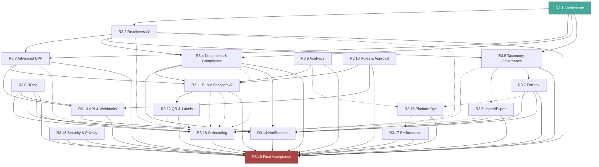

# R3 — Dependency Map

## Status: R3.1 Architecture Lock — APPROVED

---

## 1. Dependency Types

| Type | Symbol | Description |
|------|--------|-------------|
| Hard | H | Cannot begin without prior stage completion |
| Soft | S | Recommended ordering but not blocking |
| Data Contract | DC | Shares a data model or API contract |
| Migration | M | Requires database changes from prior stage |
| Security | SEC | Security review dependency |
| Parallelizable | P | Can be developed in parallel with prior |

---

## 2. Directed Dependency Graph

```
R3.1 → R3.2 [H]
R3.1 → R3.3 [H]
R3.1 → R3.4 [H]
R3.1 → R3.5 [H]
R3.1 → ALL [DC, SEC]

R3.2 → R3.3 [DC]  — DPP sections link to readiness profiles
R3.2 → R3.4 [DC]  — Document readiness references
R3.2 → R3.5 [DC]  — Readiness profile contract consumed by taxonomy assignment
R3.2 → R3.18 [S]  — Onboarding references readiness profiles

R3.3 → R3.11 [DC] — Public passport renders DPP sections
R3.3 → R3.13 [DC] — API exposes DPP section data
R3.3 → R3.18 [S]  — Onboarding references DPP sections

R3.4 → R3.11 [DC] — Public passport shows documents
R3.4 → R3.14 [DC] — Document expiry notifications
R3.4 → R3.18 [S]  — Onboarding shows compliance workflow

R3.5 → R3.18 [S]  — Onboarding can explain selected category/profile defaults
R3.5 → R3.6 [DC]  — Import/export validation references attribute governance
R3.5 → R3.7 [DC]  — Fortnox mapping references controlled vocabularies

R3.6 → R3.18 [S]  — Onboarding includes import workflow

R3.7 → R3.14 [DC] — Fortnox sync failure notifications
R3.7 → R3.15 [S]  — Platform ops shows Fortnox status

R3.8 → R3.18 [H]  — Billing required for commercial onboarding
R3.8 → R3.13 [DC] — Billing webhooks follow webhook contract

R3.9 → R3.11 [DC] — Analytics instruments public passport
R3.9 → R3.15 [S]  — Platform ops shows analytics

R3.10 → R3.11 [DC] — Publication approval workflow
R3.10 → R3.13 [DC] — API permissions for approval roles

R3.11 → R3.12 [H]  — QR labels depend on public passport v2
R3.11 → R3.18 [S]  — Onboarding shows public passport

R3.12 → R3.18 [S]  — Onboarding includes QR verification

R3.13 → R3.2-R3.11 [DC] — API needs stable data contracts from all
R3.13 → R3.14 [DC] — Webhook delivery uses notification infrastructure

R3.4 → R3.14 [DC]  — Document expiry/review events consumed by notifications
R3.6 → R3.14 [DC]  — Import completion/failure events consumed by notifications
R3.7 → R3.14 [DC]  — Fortnox sync events consumed by notifications
R3.8 → R3.14 [DC]  — Billing events consumed by notifications

R3.15 → R3.17 [S]  — Operations telemetry feeds observability

R3.16 → ALL [SEC]  — Security review of all modules
R3.16 → R3.19 [H]  — Security gate prerequisite

R3.17 → R3.19 [H]  — Performance gate prerequisite

R3.8 → R3.18 [H]   — Onboarding requires billing activation
R3.2-R3.11 → R3.18 [S] — Onboarding validates all user-facing features

R3.19 → R3.2-R3.18 [H] — Final acceptance depends on all mandatory stages
```

---

## 3. Parallelization Matrix

| Stage | Can Parallel With | Cannot Parallel With |
|-------|------------------|---------------------|
| R3.2 | — | — (first after baseline) |
| R3.3 | R3.4 | R3.2 (hard dependency) |
| R3.4 | R3.3, R3.5 | R3.2 |
| R3.5 | R3.4 | R3.2 profile contract |
| R3.6 | R3.7, R3.8 | — (after Group A) |
| R3.7 | R3.6, R3.8 | — (after Group A) |
| R3.8 | R3.6, R3.7 | — (after Group A) |
| R3.9 | R3.10 | R3.2-R3.5 (data contracts) |
| R3.10 | R3.9 | R3.2-R3.5 (data contracts) |
| R3.11 | R3.12 | R3.2-R3.4 (data contracts) |
| R3.12 | R3.11 | R3.11 (hard dependency) |
| R3.13 | R3.14 | R3.2-R3.11 (data contracts) |
| R3.14 | R3.13 | R3.4,R3.6,R3.7,R3.8 (event sources) |
| R3.15 | R3.16 | — (after R3.7,R3.9,R3.13) |
| R3.16 | R3.15, R3.17 | — (after all modules) |
| R3.17 | R3.16 | — (after R3.15) |
| R3.18 | — | R3.8 (hard), R3.2-R3.11 (soft) |
| R3.19 | — | ALL (final) |

---

## 4. Critical Path

```
R3.1 → R3.2 → R3.3 → R3.4 → R3.5  (Foundation: ~5-7 units)
  → R3.2 → R3.11 → R3.12 → R3.18    (Public UX: ~5-6 units, in parallel with below)
  → R3.5 → R3.6 → R3.7 → R3.8       (Integration: ~6-8 units, in parallel with above)
  → ALL → R3.16 → R3.17 → R3.19      (Hardening + Acceptance: ~2-3 units)
```

The longest critical path through the dependency graph:
- Foundation (R3.2-R3.5): 4 stages
- Integration (R3.6-R3.8): 3 stages (can overlap with public UX)
- Delivery (R3.13-R3.14): 2 stages (after all data contracts)
- Hardening (R3.16-R3.17): 2 stages
- Final (R3.18-R3.19): 2 stages

Total sequential stages on critical path: approximately 13 stages across 4 phases.

---

## 5. No Cyclic Dependencies

Verified: No circular hard dependencies exist in the R3 dependency graph. Data-contract edges flow from the stage that owns the contract to the stage that consumes it; event-source modules do not depend on R3.14 merely because R3.14 later listens to their events. All soft dependencies are advisory ordering recommendations, not blocking requirements.

---

## 6. Mermaid Dependency Graph



Legend: Solid arrows = hard dependency. Dashed arrows = soft dependency.

---

## 7. Dependency Verification

| Check | Status |
|-------|--------|
| No circular hard dependencies | PASS |
| All dependencies have owner stage | PASS |
| Data contract dependencies identified | PASS |
| Migration dependencies identified | PASS |
| API contract dependencies identified | PASS |
| Security review dependencies identified | PASS |
| Parallelizable pairs identified | PASS |
| All stages have clear `depends_on` | PASS |
